# kitamanager

## Tables

| Name                                                                                  | Columns | Comment | Type       |
| ------------------------------------------------------------------------------------- | ------- | ------- | ---------- |
| [public.schema_migrations](public.schema_migrations.md)                               | 2       |         | BASE TABLE |
| [public.organizations](public.organizations.md)                                       | 7       |         | BASE TABLE |
| [public.users](public.users.md)                                                       | 10      |         | BASE TABLE |
| [public.user_organizations](public.user_organizations.md)                             | 5       |         | BASE TABLE |
| [public.sections](public.sections.md)                                                 | 9       |         | BASE TABLE |
| [public.employees](public.employees.md)                                               | 8       |         | BASE TABLE |
| [public.pay_plans](public.pay_plans.md)                                               | 5       |         | BASE TABLE |
| [public.pay_plan_periods](public.pay_plan_periods.md)                                 | 8       |         | BASE TABLE |
| [public.pay_plan_entries](public.pay_plan_entries.md)                                 | 8       |         | BASE TABLE |
| [public.employee_contracts](public.employee_contracts.md)                             | 13      |         | BASE TABLE |
| [public.children](public.children.md)                                                 | 8       |         | BASE TABLE |
| [public.child_contracts](public.child_contracts.md)                                   | 8       |         | BASE TABLE |
| [public.government_fundings](public.government_fundings.md)                           | 5       |         | BASE TABLE |
| [public.government_funding_periods](public.government_funding_periods.md)             | 8       |         | BASE TABLE |
| [public.government_funding_properties](public.government_funding_properties.md)       | 12      |         | BASE TABLE |
| [public.child_attendances](public.child_attendances.md)                               | 11      |         | BASE TABLE |
| [public.budget_items](public.budget_items.md)                                         | 7       |         | BASE TABLE |
| [public.budget_item_entries](public.budget_item_entries.md)                           | 8       |         | BASE TABLE |
| [public.audit_logs](public.audit_logs.md)                                             | 12      |         | BASE TABLE |
| [public.revoked_tokens](public.revoked_tokens.md)                                     | 5       |         | BASE TABLE |
| [public.government_funding_bill_periods](public.government_funding_bill_periods.md)   | 13      |         | BASE TABLE |
| [public.government_funding_bill_children](public.government_funding_bill_children.md) | 6       |         | BASE TABLE |
| [public.government_funding_bill_payments](public.government_funding_bill_payments.md) | 7       |         | BASE TABLE |
| [public.child_vouchers](public.child_vouchers.md)                                     | 5       |         | BASE TABLE |
| [public.casbin_rule](public.casbin_rule.md)                                           | 8       |         | BASE TABLE |

## Relations

```mermaid
erDiagram

"public.user_organizations" }o--|| "public.organizations" : "FOREIGN KEY (organization_id) REFERENCES organizations(id) ON DELETE CASCADE"
"public.user_organizations" }o--|| "public.users" : "FOREIGN KEY (user_id) REFERENCES users(id) ON DELETE CASCADE"
"public.sections" }o--|| "public.organizations" : "FOREIGN KEY (organization_id) REFERENCES organizations(id) ON DELETE CASCADE"
"public.employees" }o--|| "public.organizations" : "FOREIGN KEY (organization_id) REFERENCES organizations(id) ON DELETE CASCADE"
"public.pay_plans" }o--|| "public.organizations" : "FOREIGN KEY (organization_id) REFERENCES organizations(id)"
"public.pay_plan_periods" }o--|| "public.pay_plans" : "FOREIGN KEY (pay_plan_id) REFERENCES pay_plans(id) ON DELETE CASCADE"
"public.pay_plan_entries" }o--|| "public.pay_plan_periods" : "FOREIGN KEY (period_id) REFERENCES pay_plan_periods(id) ON DELETE CASCADE"
"public.employee_contracts" }o--|| "public.sections" : "FOREIGN KEY (section_id) REFERENCES sections(id)"
"public.employee_contracts" }o--|| "public.employees" : "FOREIGN KEY (employee_id) REFERENCES employees(id) ON DELETE CASCADE"
"public.employee_contracts" }o--|| "public.pay_plans" : "FOREIGN KEY (pay_plan_id) REFERENCES pay_plans(id)"
"public.children" }o--|| "public.organizations" : "FOREIGN KEY (organization_id) REFERENCES organizations(id) ON DELETE CASCADE"
"public.child_contracts" }o--|| "public.sections" : "FOREIGN KEY (section_id) REFERENCES sections(id)"
"public.child_contracts" }o--|| "public.children" : "FOREIGN KEY (child_id) REFERENCES children(id) ON DELETE CASCADE"
"public.government_funding_periods" }o--|| "public.government_fundings" : "FOREIGN KEY (government_funding_id) REFERENCES government_fundings(id) ON DELETE CASCADE"
"public.government_funding_properties" }o--|| "public.government_funding_periods" : "FOREIGN KEY (period_id) REFERENCES government_funding_periods(id) ON DELETE CASCADE"
"public.child_attendances" }o--|| "public.organizations" : "FOREIGN KEY (organization_id) REFERENCES organizations(id) ON DELETE CASCADE"
"public.child_attendances" }o--|| "public.users" : "FOREIGN KEY (recorded_by) REFERENCES users(id)"
"public.child_attendances" }o--|| "public.children" : "FOREIGN KEY (child_id) REFERENCES children(id) ON DELETE CASCADE"
"public.budget_items" }o--|| "public.organizations" : "FOREIGN KEY (organization_id) REFERENCES organizations(id) ON DELETE CASCADE"
"public.budget_item_entries" }o--|| "public.budget_items" : "FOREIGN KEY (budget_item_id) REFERENCES budget_items(id) ON DELETE CASCADE"
"public.audit_logs" }o--o| "public.organizations" : "FOREIGN KEY (organization_id) REFERENCES organizations(id) ON DELETE SET NULL"
"public.revoked_tokens" }o--|| "public.users" : "FOREIGN KEY (user_id) REFERENCES users(id) ON DELETE CASCADE"
"public.government_funding_bill_periods" }o--|| "public.organizations" : "FOREIGN KEY (organization_id) REFERENCES organizations(id)"
"public.government_funding_bill_periods" }o--|| "public.users" : "FOREIGN KEY (created_by) REFERENCES users(id)"
"public.government_funding_bill_children" }o--|| "public.government_funding_bill_periods" : "FOREIGN KEY (period_id) REFERENCES government_funding_bill_periods(id) ON DELETE CASCADE"
"public.government_funding_bill_payments" }o--|| "public.government_funding_bill_children" : "FOREIGN KEY (child_id) REFERENCES government_funding_bill_children(id) ON DELETE CASCADE"
"public.child_vouchers" }o--|| "public.children" : "FOREIGN KEY (child_id) REFERENCES children(id) ON DELETE CASCADE"

"public.schema_migrations" {
  bigint version
  boolean dirty
}
"public.organizations" {
  bigint id
  varchar_255_ name
  boolean active
  varchar_50_ state
  timestamp_with_time_zone created_at
  varchar_255_ created_by
  timestamp_with_time_zone updated_at
}
"public.users" {
  bigint id
  varchar_255_ name
  varchar_255_ email
  varchar_255_ password
  boolean active
  boolean is_superadmin
  timestamp_with_time_zone last_login
  timestamp_with_time_zone created_at
  varchar_255_ created_by
  timestamp_with_time_zone updated_at
}
"public.user_organizations" {
  bigint user_id FK
  bigint organization_id FK
  varchar_50_ role
  timestamp_with_time_zone created_at
  varchar_255_ created_by
}
"public.sections" {
  bigint id
  bigint organization_id FK
  varchar_255_ name
  boolean is_default
  integer min_age_months
  integer max_age_months
  timestamp_with_time_zone created_at
  varchar_255_ created_by
  timestamp_with_time_zone updated_at
}
"public.employees" {
  bigint id
  bigint organization_id FK
  varchar_255_ first_name
  varchar_255_ last_name
  varchar_20_ gender
  date birthdate
  timestamp_with_time_zone created_at
  timestamp_with_time_zone updated_at
}
"public.pay_plans" {
  bigint id
  bigint organization_id FK
  text name
  timestamp_with_time_zone created_at
  timestamp_with_time_zone updated_at
}
"public.pay_plan_periods" {
  bigint id
  bigint pay_plan_id FK
  date from_date
  date to_date
  double_precision weekly_hours
  integer employer_contribution_rate
  timestamp_with_time_zone created_at
  timestamp_with_time_zone updated_at
}
"public.pay_plan_entries" {
  bigint id
  bigint period_id FK
  text grade
  integer step
  integer monthly_amount
  integer step_min_years
  timestamp_with_time_zone created_at
  timestamp_with_time_zone updated_at
}
"public.employee_contracts" {
  bigint id
  bigint employee_id FK
  date from_date
  date to_date
  bigint section_id FK
  jsonb properties
  varchar_50_ staff_category
  varchar_20_ grade
  integer step
  double_precision weekly_hours
  bigint pay_plan_id FK
  timestamp_with_time_zone created_at
  timestamp_with_time_zone updated_at
}
"public.children" {
  bigint id
  bigint organization_id FK
  varchar_255_ first_name
  varchar_255_ last_name
  varchar_20_ gender
  date birthdate
  timestamp_with_time_zone created_at
  timestamp_with_time_zone updated_at
}
"public.child_contracts" {
  bigint id
  bigint child_id FK
  date from_date
  date to_date
  bigint section_id FK
  jsonb properties
  timestamp_with_time_zone created_at
  timestamp_with_time_zone updated_at
}
"public.government_fundings" {
  bigint id
  varchar_255_ name
  varchar_50_ state
  timestamp_with_time_zone created_at
  timestamp_with_time_zone updated_at
}
"public.government_funding_periods" {
  bigint id
  bigint government_funding_id FK
  date from_date
  date to_date
  double_precision full_time_weekly_hours
  varchar_1000_ comment
  timestamp_with_time_zone created_at
  timestamp_with_time_zone updated_at
}
"public.government_funding_properties" {
  bigint id
  bigint period_id FK
  varchar_100_ key
  varchar_255_ value
  varchar_255_ label
  integer payment
  double_precision requirement
  integer min_age
  integer max_age
  varchar_500_ comment
  timestamp_with_time_zone created_at
  boolean apply_to_all_contracts
}
"public.child_attendances" {
  bigint id
  bigint child_id FK
  bigint organization_id FK
  date date
  timestamp_with_time_zone check_in_time
  timestamp_with_time_zone check_out_time
  varchar_20_ status
  varchar_500_ note
  bigint recorded_by FK
  timestamp_with_time_zone created_at
  timestamp_with_time_zone updated_at
}
"public.budget_items" {
  bigint id
  bigint organization_id FK
  varchar_255_ name
  varchar_50_ category
  boolean per_child
  timestamp_with_time_zone created_at
  timestamp_with_time_zone updated_at
}
"public.budget_item_entries" {
  bigint id
  bigint budget_item_id FK
  date from_date
  date to_date
  integer amount_cents
  varchar_500_ notes
  timestamp_with_time_zone created_at
  timestamp_with_time_zone updated_at
}
"public.audit_logs" {
  bigint id
  timestamp_with_time_zone timestamp
  bigint user_id
  varchar_255_ user_email
  varchar_100_ action
  varchar_100_ resource_type
  bigint resource_id
  varchar_45_ ip_address
  varchar_512_ user_agent
  text details
  boolean success
  bigint organization_id FK
}
"public.revoked_tokens" {
  bigint id
  bigint user_id FK
  varchar_64_ token_hash
  timestamp_with_time_zone expires_at
  timestamp_with_time_zone created_at
}
"public.government_funding_bill_periods" {
  bigint id
  bigint organization_id FK
  date from_date
  date to_date
  varchar_255_ file_name
  varchar_64_ file_sha256
  varchar_255_ facility_name
  integer facility_total
  integer contract_booking
  integer correction_booking
  bigint created_by FK
  timestamp_with_time_zone created_at
  timestamp_with_time_zone updated_at
}
"public.government_funding_bill_children" {
  bigint id
  bigint period_id FK
  varchar_20_ voucher_number
  varchar_255_ child_name
  varchar_10_ birth_date
  integer district
}
"public.government_funding_bill_payments" {
  bigint id
  bigint child_id FK
  varchar_100_ key
  varchar_255_ value
  integer amount
  bigint row_index
  varchar_20_ row_type
}
"public.child_vouchers" {
  bigint id
  bigint child_id FK
  varchar_17_ voucher_number
  date first_seen
  timestamp_with_time_zone created_at
}
"public.casbin_rule" {
  bigint id
  varchar_100_ ptype
  varchar_100_ v0
  varchar_100_ v1
  varchar_100_ v2
  varchar_100_ v3
  varchar_100_ v4
  varchar_100_ v5
}
```

---

> Generated by [tbls](https://github.com/k1LoW/tbls)
