# public.audit_logs

## Description

## Columns

| Name            | Type                     | Default                                | Nullable | Children | Parents                                         | Comment |
| --------------- | ------------------------ | -------------------------------------- | -------- | -------- | ----------------------------------------------- | ------- |
| id              | bigint                   | nextval('audit_logs_id_seq'::regclass) | false    |          |                                                 |         |
| timestamp       | timestamp with time zone |                                        | false    |          |                                                 |         |
| user_id         | bigint                   |                                        | true     |          |                                                 |         |
| user_email      | varchar(255)             |                                        | true     |          |                                                 |         |
| action          | varchar(100)             |                                        | false    |          |                                                 |         |
| resource_type   | varchar(100)             |                                        | true     |          |                                                 |         |
| resource_id     | bigint                   |                                        | true     |          |                                                 |         |
| ip_address      | varchar(45)              |                                        | true     |          |                                                 |         |
| user_agent      | varchar(512)             |                                        | true     |          |                                                 |         |
| details         | text                     |                                        | true     |          |                                                 |         |
| success         | boolean                  |                                        | false    |          |                                                 |         |
| organization_id | bigint                   |                                        | true     |          | [public.organizations](public.organizations.md) |         |

## Constraints

| Name                            | Type        | Definition                                                                    |
| ------------------------------- | ----------- | ----------------------------------------------------------------------------- |
| audit_logs_action_not_null      | n           | NOT NULL action                                                               |
| audit_logs_id_not_null          | n           | NOT NULL id                                                                   |
| audit_logs_success_not_null     | n           | NOT NULL success                                                              |
| audit_logs_timestamp_not_null   | n           | NOT NULL "timestamp"                                                          |
| audit_logs_organization_id_fkey | FOREIGN KEY | FOREIGN KEY (organization_id) REFERENCES organizations(id) ON DELETE SET NULL |
| audit_logs_pkey                 | PRIMARY KEY | PRIMARY KEY (id)                                                              |

## Indexes

| Name                     | Definition                                                                                              |
| ------------------------ | ------------------------------------------------------------------------------------------------------- |
| audit_logs_pkey          | CREATE UNIQUE INDEX audit_logs_pkey ON public.audit_logs USING btree (id)                               |
| idx_audit_logs_timestamp | CREATE INDEX idx_audit_logs_timestamp ON public.audit_logs USING btree ("timestamp")                    |
| idx_audit_logs_user_id   | CREATE INDEX idx_audit_logs_user_id ON public.audit_logs USING btree (user_id)                          |
| idx_audit_logs_action    | CREATE INDEX idx_audit_logs_action ON public.audit_logs USING btree (action)                            |
| idx_audit_logs_org_ts    | CREATE INDEX idx_audit_logs_org_ts ON public.audit_logs USING btree (organization_id, "timestamp" DESC) |

## Relations

```mermaid
erDiagram

"public.audit_logs" }o--o| "public.organizations" : "FOREIGN KEY (organization_id) REFERENCES organizations(id) ON DELETE SET NULL"
"public.user_organizations" }o--|| "public.organizations" : "FOREIGN KEY (organization_id) REFERENCES organizations(id) ON DELETE CASCADE"
"public.sections" }o--|| "public.organizations" : "FOREIGN KEY (organization_id) REFERENCES organizations(id) ON DELETE CASCADE"
"public.employees" }o--|| "public.organizations" : "FOREIGN KEY (organization_id) REFERENCES organizations(id) ON DELETE CASCADE"
"public.pay_plans" }o--|| "public.organizations" : "FOREIGN KEY (organization_id) REFERENCES organizations(id)"
"public.children" }o--|| "public.organizations" : "FOREIGN KEY (organization_id) REFERENCES organizations(id) ON DELETE CASCADE"
"public.child_attendances" }o--|| "public.organizations" : "FOREIGN KEY (organization_id) REFERENCES organizations(id) ON DELETE CASCADE"
"public.budget_items" }o--|| "public.organizations" : "FOREIGN KEY (organization_id) REFERENCES organizations(id) ON DELETE CASCADE"
"public.government_funding_bill_periods" }o--|| "public.organizations" : "FOREIGN KEY (organization_id) REFERENCES organizations(id)"

"public.audit_logs" {
  bigint id
  timestamp_with_time_zone timestamp
  bigint user_id
  varchar_255_ user_email
  varchar_100_ action
  varchar_100_ resource_type
  bigint resource_id
  varchar_45_ ip_address
  varchar_512_ user_agent
  text details
  boolean success
  bigint organization_id FK
}
"public.organizations" {
  bigint id
  varchar_255_ name
  boolean active
  varchar_50_ state
  timestamp_with_time_zone created_at
  varchar_255_ created_by
  timestamp_with_time_zone updated_at
}
"public.user_organizations" {
  bigint user_id FK
  bigint organization_id FK
  varchar_50_ role
  timestamp_with_time_zone created_at
  varchar_255_ created_by
}
"public.sections" {
  bigint id
  bigint organization_id FK
  varchar_255_ name
  boolean is_default
  integer min_age_months
  integer max_age_months
  timestamp_with_time_zone created_at
  varchar_255_ created_by
  timestamp_with_time_zone updated_at
}
"public.employees" {
  bigint id
  bigint organization_id FK
  varchar_255_ first_name
  varchar_255_ last_name
  varchar_20_ gender
  date birthdate
  timestamp_with_time_zone created_at
  timestamp_with_time_zone updated_at
}
"public.pay_plans" {
  bigint id
  bigint organization_id FK
  text name
  timestamp_with_time_zone created_at
  timestamp_with_time_zone updated_at
}
"public.children" {
  bigint id
  bigint organization_id FK
  varchar_255_ first_name
  varchar_255_ last_name
  varchar_20_ gender
  date birthdate
  timestamp_with_time_zone created_at
  timestamp_with_time_zone updated_at
}
"public.child_attendances" {
  bigint id
  bigint child_id FK
  bigint organization_id FK
  date date
  timestamp_with_time_zone check_in_time
  timestamp_with_time_zone check_out_time
  varchar_20_ status
  varchar_500_ note
  bigint recorded_by FK
  timestamp_with_time_zone created_at
  timestamp_with_time_zone updated_at
}
"public.budget_items" {
  bigint id
  bigint organization_id FK
  varchar_255_ name
  varchar_50_ category
  boolean per_child
  timestamp_with_time_zone created_at
  timestamp_with_time_zone updated_at
}
"public.government_funding_bill_periods" {
  bigint id
  bigint organization_id FK
  date from_date
  date to_date
  varchar_255_ file_name
  varchar_64_ file_sha256
  varchar_255_ facility_name
  integer facility_total
  integer contract_booking
  integer correction_booking
  bigint created_by FK
  timestamp_with_time_zone created_at
  timestamp_with_time_zone updated_at
}
```

---

> Generated by [tbls](https://github.com/k1LoW/tbls)
