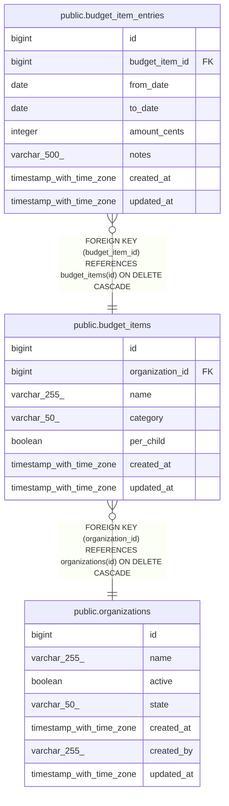

# public.budget_item_entries

## Description

## Columns

| Name           | Type                     | Default                                         | Nullable | Children | Parents                                       | Comment |
| -------------- | ------------------------ | ----------------------------------------------- | -------- | -------- | --------------------------------------------- | ------- |
| id             | bigint                   | nextval('budget_item_entries_id_seq'::regclass) | false    |          |                                               |         |
| budget_item_id | bigint                   |                                                 | false    |          | [public.budget_items](public.budget_items.md) |         |
| from_date      | date                     |                                                 | false    |          |                                               |         |
| to_date        | date                     |                                                 | true     |          |                                               |         |
| amount_cents   | integer                  |                                                 | false    |          |                                               |         |
| notes          | varchar(500)             |                                                 | true     |          |                                               |         |
| created_at     | timestamp with time zone |                                                 | true     |          |                                               |         |
| updated_at     | timestamp with time zone |                                                 | true     |          |                                               |         |

## Constraints

| Name                                        | Type        | Definition                                                                 |
| ------------------------------------------- | ----------- | -------------------------------------------------------------------------- |
| budget_item_entries_amount_cents_not_null   | n           | NOT NULL amount_cents                                                      |
| budget_item_entries_budget_item_id_not_null | n           | NOT NULL budget_item_id                                                    |
| budget_item_entries_from_date_not_null      | n           | NOT NULL from_date                                                         |
| budget_item_entries_id_not_null             | n           | NOT NULL id                                                                |
| budget_item_entries_budget_item_id_fkey     | FOREIGN KEY | FOREIGN KEY (budget_item_id) REFERENCES budget_items(id) ON DELETE CASCADE |
| budget_item_entries_pkey                    | PRIMARY KEY | PRIMARY KEY (id)                                                           |

## Indexes

| Name                                   | Definition                                                                                                        |
| -------------------------------------- | ----------------------------------------------------------------------------------------------------------------- |
| budget_item_entries_pkey               | CREATE UNIQUE INDEX budget_item_entries_pkey ON public.budget_item_entries USING btree (id)                       |
| idx_budget_item_entries_budget_item_id | CREATE INDEX idx_budget_item_entries_budget_item_id ON public.budget_item_entries USING btree (budget_item_id)    |
| idx_budget_item_entries_period         | CREATE INDEX idx_budget_item_entries_period ON public.budget_item_entries USING btree (budget_item_id, from_date) |

## Relations

---

> Generated by [tbls](https://github.com/k1LoW/tbls)
