# public.child_attendances

## Description

## Columns

| Name            | Type                     | Default                                       | Nullable | Children | Parents                                         | Comment |
| --------------- | ------------------------ | --------------------------------------------- | -------- | -------- | ----------------------------------------------- | ------- |
| id              | bigint                   | nextval('child_attendances_id_seq'::regclass) | false    |          |                                                 |         |
| child_id        | bigint                   |                                               | false    |          | [public.children](public.children.md)           |         |
| organization_id | bigint                   |                                               | false    |          | [public.organizations](public.organizations.md) |         |
| date            | date                     |                                               | false    |          |                                                 |         |
| check_in_time   | timestamp with time zone |                                               | true     |          |                                                 |         |
| check_out_time  | timestamp with time zone |                                               | true     |          |                                                 |         |
| status          | varchar(20)              | 'present'::character varying                  | false    |          |                                                 |         |
| note            | varchar(500)             |                                               | true     |          |                                                 |         |
| recorded_by     | bigint                   |                                               | false    |          | [public.users](public.users.md)                 |         |
| created_at      | timestamp with time zone |                                               | true     |          |                                                 |         |
| updated_at      | timestamp with time zone |                                               | true     |          |                                                 |         |

## Constraints

| Name                                       | Type        | Definition                                                                   |
| ------------------------------------------ | ----------- | ---------------------------------------------------------------------------- |
| child_attendances_child_id_not_null        | n           | NOT NULL child_id                                                            |
| child_attendances_date_not_null            | n           | NOT NULL date                                                                |
| child_attendances_id_not_null              | n           | NOT NULL id                                                                  |
| child_attendances_organization_id_not_null | n           | NOT NULL organization_id                                                     |
| child_attendances_recorded_by_not_null     | n           | NOT NULL recorded_by                                                         |
| child_attendances_status_not_null          | n           | NOT NULL status                                                              |
| child_attendances_organization_id_fkey     | FOREIGN KEY | FOREIGN KEY (organization_id) REFERENCES organizations(id) ON DELETE CASCADE |
| child_attendances_recorded_by_fkey         | FOREIGN KEY | FOREIGN KEY (recorded_by) REFERENCES users(id)                               |
| child_attendances_child_id_fkey            | FOREIGN KEY | FOREIGN KEY (child_id) REFERENCES children(id) ON DELETE CASCADE             |
| child_attendances_pkey                     | PRIMARY KEY | PRIMARY KEY (id)                                                             |

## Indexes

| Name                                  | Definition                                                                                                    |
| ------------------------------------- | ------------------------------------------------------------------------------------------------------------- |
| child_attendances_pkey                | CREATE UNIQUE INDEX child_attendances_pkey ON public.child_attendances USING btree (id)                       |
| idx_child_attendances_child_id        | CREATE INDEX idx_child_attendances_child_id ON public.child_attendances USING btree (child_id)                |
| idx_child_attendances_organization_id | CREATE INDEX idx_child_attendances_organization_id ON public.child_attendances USING btree (organization_id)  |
| idx_child_attendances_date            | CREATE INDEX idx_child_attendances_date ON public.child_attendances USING btree (date)                        |
| idx_child_attendances_child_date      | CREATE UNIQUE INDEX idx_child_attendances_child_date ON public.child_attendances USING btree (child_id, date) |
| idx_child_attendances_org_date        | CREATE INDEX idx_child_attendances_org_date ON public.child_attendances USING btree (organization_id, date)   |

## Relations

```mermaid
erDiagram

"public.child_attendances" }o--|| "public.children" : "FOREIGN KEY (child_id) REFERENCES children(id) ON DELETE CASCADE"
"public.child_contracts" }o--|| "public.children" : "FOREIGN KEY (child_id) REFERENCES children(id) ON DELETE CASCADE"
"public.child_vouchers" }o--|| "public.children" : "FOREIGN KEY (child_id) REFERENCES children(id) ON DELETE CASCADE"
"public.children" }o--|| "public.organizations" : "FOREIGN KEY (organization_id) REFERENCES organizations(id) ON DELETE CASCADE"
"public.child_attendances" }o--|| "public.organizations" : "FOREIGN KEY (organization_id) REFERENCES organizations(id) ON DELETE CASCADE"
"public.user_organizations" }o--|| "public.organizations" : "FOREIGN KEY (organization_id) REFERENCES organizations(id) ON DELETE CASCADE"
"public.sections" }o--|| "public.organizations" : "FOREIGN KEY (organization_id) REFERENCES organizations(id) ON DELETE CASCADE"
"public.employees" }o--|| "public.organizations" : "FOREIGN KEY (organization_id) REFERENCES organizations(id) ON DELETE CASCADE"
"public.pay_plans" }o--|| "public.organizations" : "FOREIGN KEY (organization_id) REFERENCES organizations(id)"
"public.budget_items" }o--|| "public.organizations" : "FOREIGN KEY (organization_id) REFERENCES organizations(id) ON DELETE CASCADE"
"public.audit_logs" }o--o| "public.organizations" : "FOREIGN KEY (organization_id) REFERENCES organizations(id) ON DELETE SET NULL"
"public.government_funding_bill_periods" }o--|| "public.organizations" : "FOREIGN KEY (organization_id) REFERENCES organizations(id)"
"public.child_attendances" }o--|| "public.users" : "FOREIGN KEY (recorded_by) REFERENCES users(id)"
"public.user_organizations" }o--|| "public.users" : "FOREIGN KEY (user_id) REFERENCES users(id) ON DELETE CASCADE"
"public.revoked_tokens" }o--|| "public.users" : "FOREIGN KEY (user_id) REFERENCES users(id) ON DELETE CASCADE"
"public.government_funding_bill_periods" }o--|| "public.users" : "FOREIGN KEY (created_by) REFERENCES users(id)"

"public.child_attendances" {
  bigint id
  bigint child_id FK
  bigint organization_id FK
  date date
  timestamp_with_time_zone check_in_time
  timestamp_with_time_zone check_out_time
  varchar_20_ status
  varchar_500_ note
  bigint recorded_by FK
  timestamp_with_time_zone created_at
  timestamp_with_time_zone updated_at
}
"public.children" {
  bigint id
  bigint organization_id FK
  varchar_255_ first_name
  varchar_255_ last_name
  varchar_20_ gender
  date birthdate
  timestamp_with_time_zone created_at
  timestamp_with_time_zone updated_at
}
"public.child_contracts" {
  bigint id
  bigint child_id FK
  date from_date
  date to_date
  bigint section_id FK
  jsonb properties
  timestamp_with_time_zone created_at
  timestamp_with_time_zone updated_at
}
"public.child_vouchers" {
  bigint id
  bigint child_id FK
  varchar_17_ voucher_number
  date first_seen
  timestamp_with_time_zone created_at
}
"public.organizations" {
  bigint id
  varchar_255_ name
  boolean active
  varchar_50_ state
  timestamp_with_time_zone created_at
  varchar_255_ created_by
  timestamp_with_time_zone updated_at
}
"public.user_organizations" {
  bigint user_id FK
  bigint organization_id FK
  varchar_50_ role
  timestamp_with_time_zone created_at
  varchar_255_ created_by
}
"public.sections" {
  bigint id
  bigint organization_id FK
  varchar_255_ name
  boolean is_default
  integer min_age_months
  integer max_age_months
  timestamp_with_time_zone created_at
  varchar_255_ created_by
  timestamp_with_time_zone updated_at
}
"public.employees" {
  bigint id
  bigint organization_id FK
  varchar_255_ first_name
  varchar_255_ last_name
  varchar_20_ gender
  date birthdate
  timestamp_with_time_zone created_at
  timestamp_with_time_zone updated_at
}
"public.pay_plans" {
  bigint id
  bigint organization_id FK
  text name
  timestamp_with_time_zone created_at
  timestamp_with_time_zone updated_at
}
"public.budget_items" {
  bigint id
  bigint organization_id FK
  varchar_255_ name
  varchar_50_ category
  boolean per_child
  timestamp_with_time_zone created_at
  timestamp_with_time_zone updated_at
}
"public.audit_logs" {
  bigint id
  timestamp_with_time_zone timestamp
  bigint user_id
  varchar_255_ user_email
  varchar_100_ action
  varchar_100_ resource_type
  bigint resource_id
  varchar_45_ ip_address
  varchar_512_ user_agent
  text details
  boolean success
  bigint organization_id FK
}
"public.government_funding_bill_periods" {
  bigint id
  bigint organization_id FK
  date from_date
  date to_date
  varchar_255_ file_name
  varchar_64_ file_sha256
  varchar_255_ facility_name
  integer facility_total
  integer contract_booking
  integer correction_booking
  bigint created_by FK
  timestamp_with_time_zone created_at
  timestamp_with_time_zone updated_at
}
"public.users" {
  bigint id
  varchar_255_ name
  varchar_255_ email
  varchar_255_ password
  boolean active
  boolean is_superadmin
  timestamp_with_time_zone last_login
  timestamp_with_time_zone created_at
  varchar_255_ created_by
  timestamp_with_time_zone updated_at
}
"public.revoked_tokens" {
  bigint id
  bigint user_id FK
  varchar_64_ token_hash
  timestamp_with_time_zone expires_at
  timestamp_with_time_zone created_at
}
```

---

> Generated by [tbls](https://github.com/k1LoW/tbls)
