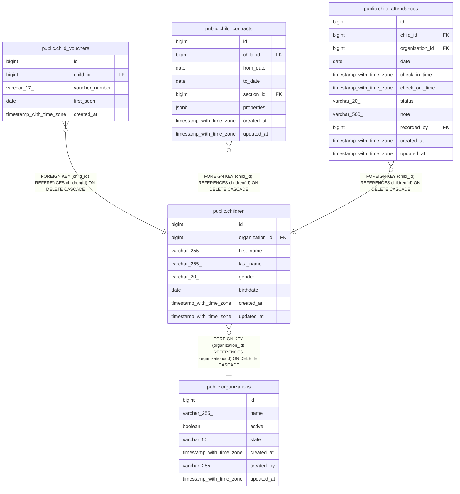

# public.child_vouchers

## Description

## Columns

| Name           | Type                     | Default                                    | Nullable | Children | Parents                               | Comment |
| -------------- | ------------------------ | ------------------------------------------ | -------- | -------- | ------------------------------------- | ------- |
| id             | bigint                   | nextval('child_vouchers_id_seq'::regclass) | false    |          |                                       |         |
| child_id       | bigint                   |                                            | false    |          | [public.children](public.children.md) |         |
| voucher_number | varchar(17)              |                                            | false    |          |                                       |         |
| first_seen     | date                     |                                            | false    |          |                                       |         |
| created_at     | timestamp with time zone |                                            | true     |          |                                       |         |

## Constraints

| Name                                   | Type        | Definition                                                       |
| -------------------------------------- | ----------- | ---------------------------------------------------------------- |
| child_vouchers_child_id_not_null       | n           | NOT NULL child_id                                                |
| child_vouchers_first_seen_not_null     | n           | NOT NULL first_seen                                              |
| child_vouchers_id_not_null             | n           | NOT NULL id                                                      |
| child_vouchers_voucher_number_not_null | n           | NOT NULL voucher_number                                          |
| child_vouchers_child_id_fkey           | FOREIGN KEY | FOREIGN KEY (child_id) REFERENCES children(id) ON DELETE CASCADE |
| child_vouchers_pkey                    | PRIMARY KEY | PRIMARY KEY (id)                                                 |
| uni_child_vouchers_voucher_number      | UNIQUE      | UNIQUE (voucher_number)                                          |

## Indexes

| Name                              | Definition                                                                                                  |
| --------------------------------- | ----------------------------------------------------------------------------------------------------------- |
| child_vouchers_pkey               | CREATE UNIQUE INDEX child_vouchers_pkey ON public.child_vouchers USING btree (id)                           |
| uni_child_vouchers_voucher_number | CREATE UNIQUE INDEX uni_child_vouchers_voucher_number ON public.child_vouchers USING btree (voucher_number) |
| idx_child_vouchers_child_id       | CREATE INDEX idx_child_vouchers_child_id ON public.child_vouchers USING btree (child_id)                    |

## Relations

---

> Generated by [tbls](https://github.com/k1LoW/tbls)
