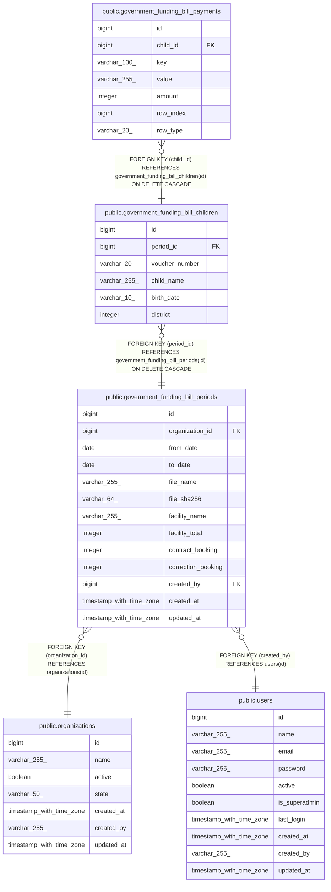

# public.government_funding_bill_children

## Description

## Columns

| Name           | Type         | Default                                                      | Nullable | Children                                                                              | Parents                                                                             | Comment |
| -------------- | ------------ | ------------------------------------------------------------ | -------- | ------------------------------------------------------------------------------------- | ----------------------------------------------------------------------------------- | ------- |
| id             | bigint       | nextval('government_funding_bill_children_id_seq'::regclass) | false    | [public.government_funding_bill_payments](public.government_funding_bill_payments.md) |                                                                                     |         |
| period_id      | bigint       |                                                              | false    |                                                                                       | [public.government_funding_bill_periods](public.government_funding_bill_periods.md) |         |
| voucher_number | varchar(20)  |                                                              | false    |                                                                                       |                                                                                     |         |
| child_name     | varchar(255) |                                                              | false    |                                                                                       |                                                                                     |         |
| birth_date     | varchar(10)  |                                                              | false    |                                                                                       |                                                                                     |         |
| district       | integer      |                                                              | false    |                                                                                       |                                                                                     |         |

## Constraints

| Name                                                     | Type        | Definition                                                                               |
| -------------------------------------------------------- | ----------- | ---------------------------------------------------------------------------------------- |
| government_funding_bill_children_birth_date_not_null     | n           | NOT NULL birth_date                                                                      |
| government_funding_bill_children_child_name_not_null     | n           | NOT NULL child_name                                                                      |
| government_funding_bill_children_district_not_null       | n           | NOT NULL district                                                                        |
| government_funding_bill_children_id_not_null             | n           | NOT NULL id                                                                              |
| government_funding_bill_children_period_id_not_null      | n           | NOT NULL period_id                                                                       |
| government_funding_bill_children_voucher_number_not_null | n           | NOT NULL voucher_number                                                                  |
| government_funding_bill_children_period_id_fkey          | FOREIGN KEY | FOREIGN KEY (period_id) REFERENCES government_funding_bill_periods(id) ON DELETE CASCADE |
| government_funding_bill_children_pkey                    | PRIMARY KEY | PRIMARY KEY (id)                                                                         |

## Indexes

| Name                                  | Definition                                                                                                            |
| ------------------------------------- | --------------------------------------------------------------------------------------------------------------------- |
| government_funding_bill_children_pkey | CREATE UNIQUE INDEX government_funding_bill_children_pkey ON public.government_funding_bill_children USING btree (id) |
| idx_gfbc_period                       | CREATE INDEX idx_gfbc_period ON public.government_funding_bill_children USING btree (period_id)                       |

## Relations

---

> Generated by [tbls](https://github.com/k1LoW/tbls)
