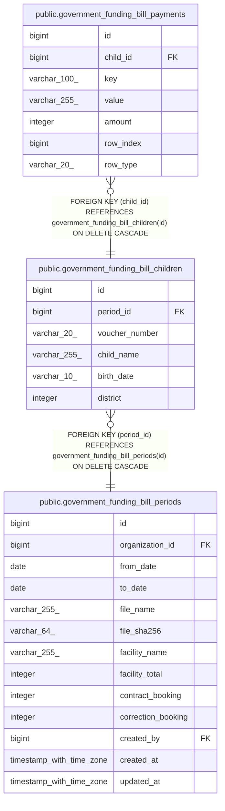

# public.government_funding_bill_payments

## Description

## Columns

| Name      | Type         | Default                                                      | Nullable | Children | Parents                                                                               | Comment |
| --------- | ------------ | ------------------------------------------------------------ | -------- | -------- | ------------------------------------------------------------------------------------- | ------- |
| id        | bigint       | nextval('government_funding_bill_payments_id_seq'::regclass) | false    |          |                                                                                       |         |
| child_id  | bigint       |                                                              | false    |          | [public.government_funding_bill_children](public.government_funding_bill_children.md) |         |
| key       | varchar(100) |                                                              | false    |          |                                                                                       |         |
| value     | varchar(255) |                                                              | false    |          |                                                                                       |         |
| amount    | integer      |                                                              | false    |          |                                                                                       |         |
| row_index | bigint       | 0                                                            | false    |          |                                                                                       |         |
| row_type  | varchar(20)  | 'regular'::character varying                                 | false    |          |                                                                                       |         |

## Constraints

| Name                                                | Type        | Definition                                                                               |
| --------------------------------------------------- | ----------- | ---------------------------------------------------------------------------------------- |
| government_funding_bill_payments_amount_not_null    | n           | NOT NULL amount                                                                          |
| government_funding_bill_payments_child_id_not_null  | n           | NOT NULL child_id                                                                        |
| government_funding_bill_payments_id_not_null        | n           | NOT NULL id                                                                              |
| government_funding_bill_payments_key_not_null       | n           | NOT NULL key                                                                             |
| government_funding_bill_payments_row_index_not_null | n           | NOT NULL row_index                                                                       |
| government_funding_bill_payments_row_type_not_null  | n           | NOT NULL row_type                                                                        |
| government_funding_bill_payments_value_not_null     | n           | NOT NULL value                                                                           |
| government_funding_bill_payments_child_id_fkey      | FOREIGN KEY | FOREIGN KEY (child_id) REFERENCES government_funding_bill_children(id) ON DELETE CASCADE |
| government_funding_bill_payments_pkey               | PRIMARY KEY | PRIMARY KEY (id)                                                                         |

## Indexes

| Name                                  | Definition                                                                                                            |
| ------------------------------------- | --------------------------------------------------------------------------------------------------------------------- |
| government_funding_bill_payments_pkey | CREATE UNIQUE INDEX government_funding_bill_payments_pkey ON public.government_funding_bill_payments USING btree (id) |
| idx_gfbpay_child                      | CREATE INDEX idx_gfbpay_child ON public.government_funding_bill_payments USING btree (child_id)                       |

## Relations

---

> Generated by [tbls](https://github.com/k1LoW/tbls)
