# public.government_funding_bill_periods

## Description

## Columns

| Name               | Type                     | Default                                                     | Nullable | Children                                                                              | Parents                                         | Comment |
| ------------------ | ------------------------ | ----------------------------------------------------------- | -------- | ------------------------------------------------------------------------------------- | ----------------------------------------------- | ------- |
| id                 | bigint                   | nextval('government_funding_bill_periods_id_seq'::regclass) | false    | [public.government_funding_bill_children](public.government_funding_bill_children.md) |                                                 |         |
| organization_id    | bigint                   |                                                             | false    |                                                                                       | [public.organizations](public.organizations.md) |         |
| from_date          | date                     |                                                             | false    |                                                                                       |                                                 |         |
| to_date            | date                     |                                                             | true     |                                                                                       |                                                 |         |
| file_name          | varchar(255)             |                                                             | false    |                                                                                       |                                                 |         |
| file_sha256        | varchar(64)              |                                                             | false    |                                                                                       |                                                 |         |
| facility_name      | varchar(255)             |                                                             | false    |                                                                                       |                                                 |         |
| facility_total     | integer                  |                                                             | false    |                                                                                       |                                                 |         |
| contract_booking   | integer                  |                                                             | false    |                                                                                       |                                                 |         |
| correction_booking | integer                  |                                                             | false    |                                                                                       |                                                 |         |
| created_by         | bigint                   |                                                             | false    |                                                                                       | [public.users](public.users.md)                 |         |
| created_at         | timestamp with time zone |                                                             | true     |                                                                                       |                                                 |         |
| updated_at         | timestamp with time zone |                                                             | true     |                                                                                       |                                                 |         |

## Constraints

| Name                                                        | Type        | Definition                                                 |
| ----------------------------------------------------------- | ----------- | ---------------------------------------------------------- |
| government_funding_bill_periods_contract_booking_not_null   | n           | NOT NULL contract_booking                                  |
| government_funding_bill_periods_correction_booking_not_null | n           | NOT NULL correction_booking                                |
| government_funding_bill_periods_created_by_not_null         | n           | NOT NULL created_by                                        |
| government_funding_bill_periods_facility_name_not_null      | n           | NOT NULL facility_name                                     |
| government_funding_bill_periods_facility_total_not_null     | n           | NOT NULL facility_total                                    |
| government_funding_bill_periods_file_name_not_null          | n           | NOT NULL file_name                                         |
| government_funding_bill_periods_file_sha256_not_null        | n           | NOT NULL file_sha256                                       |
| government_funding_bill_periods_from_date_not_null          | n           | NOT NULL from_date                                         |
| government_funding_bill_periods_id_not_null                 | n           | NOT NULL id                                                |
| government_funding_bill_periods_organization_id_not_null    | n           | NOT NULL organization_id                                   |
| government_funding_bill_periods_organization_id_fkey        | FOREIGN KEY | FOREIGN KEY (organization_id) REFERENCES organizations(id) |
| government_funding_bill_periods_created_by_fkey             | FOREIGN KEY | FOREIGN KEY (created_by) REFERENCES users(id)              |
| government_funding_bill_periods_pkey                        | PRIMARY KEY | PRIMARY KEY (id)                                           |

## Indexes

| Name                                 | Definition                                                                                                                         |
| ------------------------------------ | ---------------------------------------------------------------------------------------------------------------------------------- |
| government_funding_bill_periods_pkey | CREATE UNIQUE INDEX government_funding_bill_periods_pkey ON public.government_funding_bill_periods USING btree (id)                |
| idx_gfbp_org                         | CREATE INDEX idx_gfbp_org ON public.government_funding_bill_periods USING btree (organization_id)                                  |
| idx_bill_periods_org_hash            | CREATE UNIQUE INDEX idx_bill_periods_org_hash ON public.government_funding_bill_periods USING btree (organization_id, file_sha256) |
| idx_bill_periods_org_month           | CREATE UNIQUE INDEX idx_bill_periods_org_month ON public.government_funding_bill_periods USING btree (organization_id, from_date)  |

## Relations

```mermaid
erDiagram

"public.government_funding_bill_children" }o--|| "public.government_funding_bill_periods" : "FOREIGN KEY (period_id) REFERENCES government_funding_bill_periods(id) ON DELETE CASCADE"
"public.government_funding_bill_payments" }o--|| "public.government_funding_bill_children" : "FOREIGN KEY (child_id) REFERENCES government_funding_bill_children(id) ON DELETE CASCADE"
"public.government_funding_bill_periods" }o--|| "public.organizations" : "FOREIGN KEY (organization_id) REFERENCES organizations(id)"
"public.user_organizations" }o--|| "public.organizations" : "FOREIGN KEY (organization_id) REFERENCES organizations(id) ON DELETE CASCADE"
"public.sections" }o--|| "public.organizations" : "FOREIGN KEY (organization_id) REFERENCES organizations(id) ON DELETE CASCADE"
"public.employees" }o--|| "public.organizations" : "FOREIGN KEY (organization_id) REFERENCES organizations(id) ON DELETE CASCADE"
"public.pay_plans" }o--|| "public.organizations" : "FOREIGN KEY (organization_id) REFERENCES organizations(id)"
"public.children" }o--|| "public.organizations" : "FOREIGN KEY (organization_id) REFERENCES organizations(id) ON DELETE CASCADE"
"public.child_attendances" }o--|| "public.organizations" : "FOREIGN KEY (organization_id) REFERENCES organizations(id) ON DELETE CASCADE"
"public.budget_items" }o--|| "public.organizations" : "FOREIGN KEY (organization_id) REFERENCES organizations(id) ON DELETE CASCADE"
"public.audit_logs" }o--o| "public.organizations" : "FOREIGN KEY (organization_id) REFERENCES organizations(id) ON DELETE SET NULL"
"public.government_funding_bill_periods" }o--|| "public.users" : "FOREIGN KEY (created_by) REFERENCES users(id)"
"public.user_organizations" }o--|| "public.users" : "FOREIGN KEY (user_id) REFERENCES users(id) ON DELETE CASCADE"
"public.child_attendances" }o--|| "public.users" : "FOREIGN KEY (recorded_by) REFERENCES users(id)"
"public.revoked_tokens" }o--|| "public.users" : "FOREIGN KEY (user_id) REFERENCES users(id) ON DELETE CASCADE"

"public.government_funding_bill_periods" {
  bigint id
  bigint organization_id FK
  date from_date
  date to_date
  varchar_255_ file_name
  varchar_64_ file_sha256
  varchar_255_ facility_name
  integer facility_total
  integer contract_booking
  integer correction_booking
  bigint created_by FK
  timestamp_with_time_zone created_at
  timestamp_with_time_zone updated_at
}
"public.government_funding_bill_children" {
  bigint id
  bigint period_id FK
  varchar_20_ voucher_number
  varchar_255_ child_name
  varchar_10_ birth_date
  integer district
}
"public.government_funding_bill_payments" {
  bigint id
  bigint child_id FK
  varchar_100_ key
  varchar_255_ value
  integer amount
  bigint row_index
  varchar_20_ row_type
}
"public.organizations" {
  bigint id
  varchar_255_ name
  boolean active
  varchar_50_ state
  timestamp_with_time_zone created_at
  varchar_255_ created_by
  timestamp_with_time_zone updated_at
}
"public.user_organizations" {
  bigint user_id FK
  bigint organization_id FK
  varchar_50_ role
  timestamp_with_time_zone created_at
  varchar_255_ created_by
}
"public.sections" {
  bigint id
  bigint organization_id FK
  varchar_255_ name
  boolean is_default
  integer min_age_months
  integer max_age_months
  timestamp_with_time_zone created_at
  varchar_255_ created_by
  timestamp_with_time_zone updated_at
}
"public.employees" {
  bigint id
  bigint organization_id FK
  varchar_255_ first_name
  varchar_255_ last_name
  varchar_20_ gender
  date birthdate
  timestamp_with_time_zone created_at
  timestamp_with_time_zone updated_at
}
"public.pay_plans" {
  bigint id
  bigint organization_id FK
  text name
  timestamp_with_time_zone created_at
  timestamp_with_time_zone updated_at
}
"public.children" {
  bigint id
  bigint organization_id FK
  varchar_255_ first_name
  varchar_255_ last_name
  varchar_20_ gender
  date birthdate
  timestamp_with_time_zone created_at
  timestamp_with_time_zone updated_at
}
"public.child_attendances" {
  bigint id
  bigint child_id FK
  bigint organization_id FK
  date date
  timestamp_with_time_zone check_in_time
  timestamp_with_time_zone check_out_time
  varchar_20_ status
  varchar_500_ note
  bigint recorded_by FK
  timestamp_with_time_zone created_at
  timestamp_with_time_zone updated_at
}
"public.budget_items" {
  bigint id
  bigint organization_id FK
  varchar_255_ name
  varchar_50_ category
  boolean per_child
  timestamp_with_time_zone created_at
  timestamp_with_time_zone updated_at
}
"public.audit_logs" {
  bigint id
  timestamp_with_time_zone timestamp
  bigint user_id
  varchar_255_ user_email
  varchar_100_ action
  varchar_100_ resource_type
  bigint resource_id
  varchar_45_ ip_address
  varchar_512_ user_agent
  text details
  boolean success
  bigint organization_id FK
}
"public.users" {
  bigint id
  varchar_255_ name
  varchar_255_ email
  varchar_255_ password
  boolean active
  boolean is_superadmin
  timestamp_with_time_zone last_login
  timestamp_with_time_zone created_at
  varchar_255_ created_by
  timestamp_with_time_zone updated_at
}
"public.revoked_tokens" {
  bigint id
  bigint user_id FK
  varchar_64_ token_hash
  timestamp_with_time_zone expires_at
  timestamp_with_time_zone created_at
}
```

---

> Generated by [tbls](https://github.com/k1LoW/tbls)
