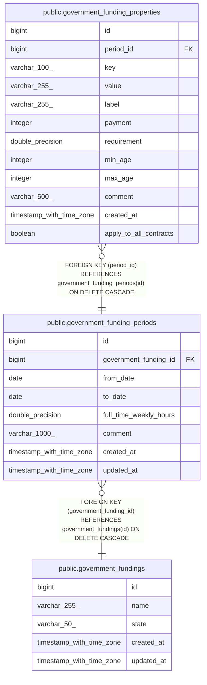

# public.government_funding_periods

## Description

## Columns

| Name                   | Type                     | Default                                                | Nullable | Children                                                                        | Parents                                                     | Comment |
| ---------------------- | ------------------------ | ------------------------------------------------------ | -------- | ------------------------------------------------------------------------------- | ----------------------------------------------------------- | ------- |
| id                     | bigint                   | nextval('government_funding_periods_id_seq'::regclass) | false    | [public.government_funding_properties](public.government_funding_properties.md) |                                                             |         |
| government_funding_id  | bigint                   |                                                        | false    |                                                                                 | [public.government_fundings](public.government_fundings.md) |         |
| from_date              | date                     |                                                        | false    |                                                                                 |                                                             |         |
| to_date                | date                     |                                                        | true     |                                                                                 |                                                             |         |
| full_time_weekly_hours | double precision         |                                                        | false    |                                                                                 |                                                             |         |
| comment                | varchar(1000)            |                                                        | true     |                                                                                 |                                                             |         |
| created_at             | timestamp with time zone |                                                        | true     |                                                                                 |                                                             |         |
| updated_at             | timestamp with time zone |                                                        | true     |                                                                                 |                                                             |         |

## Constraints

| Name                                                       | Type        | Definition                                                                               |
| ---------------------------------------------------------- | ----------- | ---------------------------------------------------------------------------------------- |
| government_funding_periods_from_date_not_null              | n           | NOT NULL from_date                                                                       |
| government_funding_periods_full_time_weekly_hours_not_null | n           | NOT NULL full_time_weekly_hours                                                          |
| government_funding_periods_government_funding_id_not_null  | n           | NOT NULL government_funding_id                                                           |
| government_funding_periods_id_not_null                     | n           | NOT NULL id                                                                              |
| government_funding_periods_government_funding_id_fkey      | FOREIGN KEY | FOREIGN KEY (government_funding_id) REFERENCES government_fundings(id) ON DELETE CASCADE |
| government_funding_periods_pkey                            | PRIMARY KEY | PRIMARY KEY (id)                                                                         |

## Indexes

| Name                               | Definition                                                                                                                      |
| ---------------------------------- | ------------------------------------------------------------------------------------------------------------------------------- |
| government_funding_periods_pkey    | CREATE UNIQUE INDEX government_funding_periods_pkey ON public.government_funding_periods USING btree (id)                       |
| idx_gov_funding_periods_funding_id | CREATE INDEX idx_gov_funding_periods_funding_id ON public.government_funding_periods USING btree (government_funding_id)        |
| idx_gov_funding_periods_period     | CREATE INDEX idx_gov_funding_periods_period ON public.government_funding_periods USING btree (government_funding_id, from_date) |

## Relations

---

> Generated by [tbls](https://github.com/k1LoW/tbls)
