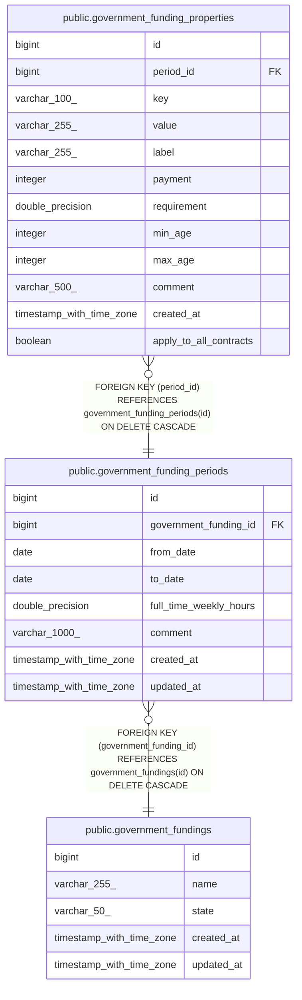

# public.government_funding_properties

## Description

## Columns

| Name                   | Type                     | Default                                                   | Nullable | Children | Parents                                                                   | Comment |
| ---------------------- | ------------------------ | --------------------------------------------------------- | -------- | -------- | ------------------------------------------------------------------------- | ------- |
| id                     | bigint                   | nextval('government_funding_properties_id_seq'::regclass) | false    |          |                                                                           |         |
| period_id              | bigint                   |                                                           | false    |          | [public.government_funding_periods](public.government_funding_periods.md) |         |
| key                    | varchar(100)             |                                                           | false    |          |                                                                           |         |
| value                  | varchar(255)             |                                                           | false    |          |                                                                           |         |
| label                  | varchar(255)             |                                                           | false    |          |                                                                           |         |
| payment                | integer                  |                                                           | false    |          |                                                                           |         |
| requirement            | double precision         |                                                           | false    |          |                                                                           |         |
| min_age                | integer                  |                                                           | true     |          |                                                                           |         |
| max_age                | integer                  |                                                           | true     |          |                                                                           |         |
| comment                | varchar(500)             |                                                           | true     |          |                                                                           |         |
| created_at             | timestamp with time zone |                                                           | true     |          |                                                                           |         |
| apply_to_all_contracts | boolean                  | false                                                     | false    |          |                                                                           |         |

## Constraints

| Name                                                          | Type        | Definition                                                                          |
| ------------------------------------------------------------- | ----------- | ----------------------------------------------------------------------------------- |
| government_funding_properties_apply_to_all_contracts_not_null | n           | NOT NULL apply_to_all_contracts                                                     |
| government_funding_properties_id_not_null                     | n           | NOT NULL id                                                                         |
| government_funding_properties_key_not_null                    | n           | NOT NULL key                                                                        |
| government_funding_properties_label_not_null                  | n           | NOT NULL label                                                                      |
| government_funding_properties_payment_not_null                | n           | NOT NULL payment                                                                    |
| government_funding_properties_period_id_not_null              | n           | NOT NULL period_id                                                                  |
| government_funding_properties_requirement_not_null            | n           | NOT NULL requirement                                                                |
| government_funding_properties_value_not_null                  | n           | NOT NULL value                                                                      |
| government_funding_properties_period_id_fkey                  | FOREIGN KEY | FOREIGN KEY (period_id) REFERENCES government_funding_periods(id) ON DELETE CASCADE |
| government_funding_properties_pkey                            | PRIMARY KEY | PRIMARY KEY (id)                                                                    |

## Indexes

| Name                                 | Definition                                                                                                        |
| ------------------------------------ | ----------------------------------------------------------------------------------------------------------------- |
| government_funding_properties_pkey   | CREATE UNIQUE INDEX government_funding_properties_pkey ON public.government_funding_properties USING btree (id)   |
| idx_gov_funding_properties_period_id | CREATE INDEX idx_gov_funding_properties_period_id ON public.government_funding_properties USING btree (period_id) |

## Relations

---

> Generated by [tbls](https://github.com/k1LoW/tbls)
