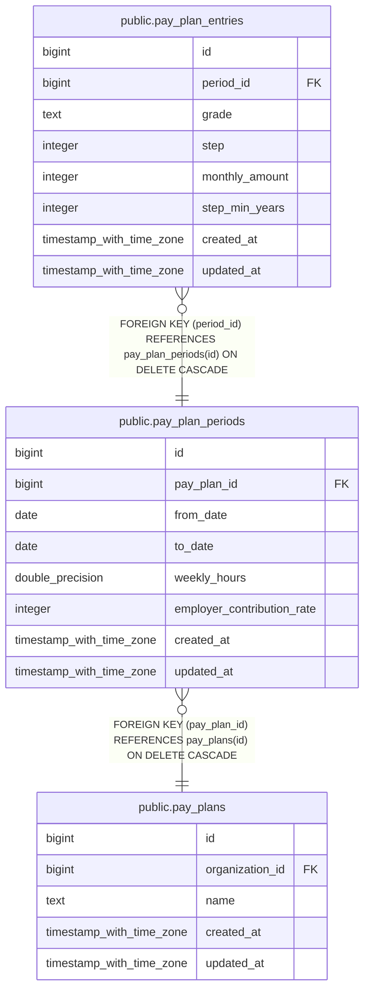

# public.pay_plan_entries

## Description

## Columns

| Name           | Type                     | Default                                      | Nullable | Children | Parents                                               | Comment |
| -------------- | ------------------------ | -------------------------------------------- | -------- | -------- | ----------------------------------------------------- | ------- |
| id             | bigint                   | nextval('pay_plan_entries_id_seq'::regclass) | false    |          |                                                       |         |
| period_id      | bigint                   |                                              | false    |          | [public.pay_plan_periods](public.pay_plan_periods.md) |         |
| grade          | text                     |                                              | false    |          |                                                       |         |
| step           | integer                  |                                              | false    |          |                                                       |         |
| monthly_amount | integer                  |                                              | false    |          |                                                       |         |
| step_min_years | integer                  |                                              | true     |          |                                                       |         |
| created_at     | timestamp with time zone |                                              | true     |          |                                                       |         |
| updated_at     | timestamp with time zone |                                              | true     |          |                                                       |         |

## Constraints

| Name                                     | Type        | Definition                                                                |
| ---------------------------------------- | ----------- | ------------------------------------------------------------------------- |
| pay_plan_entries_grade_not_null          | n           | NOT NULL grade                                                            |
| pay_plan_entries_id_not_null             | n           | NOT NULL id                                                               |
| pay_plan_entries_monthly_amount_not_null | n           | NOT NULL monthly_amount                                                   |
| pay_plan_entries_period_id_not_null      | n           | NOT NULL period_id                                                        |
| pay_plan_entries_step_not_null           | n           | NOT NULL step                                                             |
| pay_plan_entries_period_id_fkey          | FOREIGN KEY | FOREIGN KEY (period_id) REFERENCES pay_plan_periods(id) ON DELETE CASCADE |
| pay_plan_entries_pkey                    | PRIMARY KEY | PRIMARY KEY (id)                                                          |

## Indexes

| Name                           | Definition                                                                                                      |
| ------------------------------ | --------------------------------------------------------------------------------------------------------------- |
| pay_plan_entries_pkey          | CREATE UNIQUE INDEX pay_plan_entries_pkey ON public.pay_plan_entries USING btree (id)                           |
| idx_pay_plan_entries_period_id | CREATE INDEX idx_pay_plan_entries_period_id ON public.pay_plan_entries USING btree (period_id)                  |
| idx_pay_plan_entries_lookup    | CREATE UNIQUE INDEX idx_pay_plan_entries_lookup ON public.pay_plan_entries USING btree (period_id, grade, step) |

## Relations

---

> Generated by [tbls](https://github.com/k1LoW/tbls)
