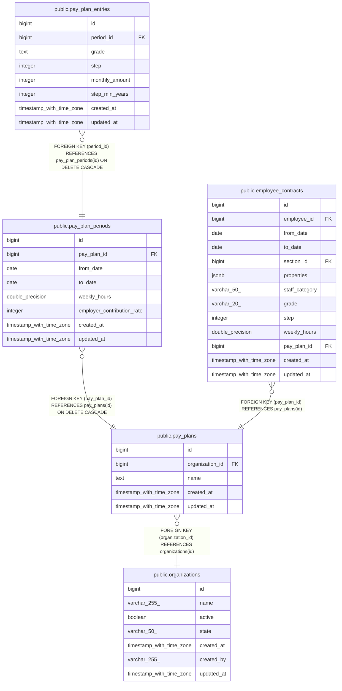

# public.pay_plan_periods

## Description

## Columns

| Name                       | Type                     | Default                                      | Nullable | Children                                              | Parents                                 | Comment |
| -------------------------- | ------------------------ | -------------------------------------------- | -------- | ----------------------------------------------------- | --------------------------------------- | ------- |
| id                         | bigint                   | nextval('pay_plan_periods_id_seq'::regclass) | false    | [public.pay_plan_entries](public.pay_plan_entries.md) |                                         |         |
| pay_plan_id                | bigint                   |                                              | false    |                                                       | [public.pay_plans](public.pay_plans.md) |         |
| from_date                  | date                     |                                              | false    |                                                       |                                         |         |
| to_date                    | date                     |                                              | true     |                                                       |                                         |         |
| weekly_hours               | double precision         |                                              | false    |                                                       |                                         |         |
| employer_contribution_rate | integer                  |                                              | true     |                                                       |                                         |         |
| created_at                 | timestamp with time zone |                                              | true     |                                                       |                                         |         |
| updated_at                 | timestamp with time zone |                                              | true     |                                                       |                                         |         |

## Constraints

| Name                                   | Type        | Definition                                                           |
| -------------------------------------- | ----------- | -------------------------------------------------------------------- |
| pay_plan_periods_from_date_not_null    | n           | NOT NULL from_date                                                   |
| pay_plan_periods_id_not_null           | n           | NOT NULL id                                                          |
| pay_plan_periods_pay_plan_id_not_null  | n           | NOT NULL pay_plan_id                                                 |
| pay_plan_periods_weekly_hours_not_null | n           | NOT NULL weekly_hours                                                |
| pay_plan_periods_pay_plan_id_fkey      | FOREIGN KEY | FOREIGN KEY (pay_plan_id) REFERENCES pay_plans(id) ON DELETE CASCADE |
| pay_plan_periods_pkey                  | PRIMARY KEY | PRIMARY KEY (id)                                                     |

## Indexes

| Name                             | Definition                                                                                               |
| -------------------------------- | -------------------------------------------------------------------------------------------------------- |
| pay_plan_periods_pkey            | CREATE UNIQUE INDEX pay_plan_periods_pkey ON public.pay_plan_periods USING btree (id)                    |
| idx_pay_plan_periods_pay_plan_id | CREATE INDEX idx_pay_plan_periods_pay_plan_id ON public.pay_plan_periods USING btree (pay_plan_id)       |
| idx_pay_plan_periods_period      | CREATE INDEX idx_pay_plan_periods_period ON public.pay_plan_periods USING btree (pay_plan_id, from_date) |

## Relations

---

> Generated by [tbls](https://github.com/k1LoW/tbls)
