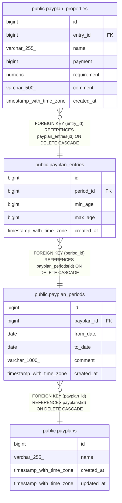

# public.payplan_entries

## Description

## Columns

| Name       | Type                     | Default                                     | Nullable | Children                                                  | Parents                                             | Comment |
| ---------- | ------------------------ | ------------------------------------------- | -------- | --------------------------------------------------------- | --------------------------------------------------- | ------- |
| id         | bigint                   | nextval('payplan_entries_id_seq'::regclass) | false    | [public.payplan_properties](public.payplan_properties.md) |                                                     |         |
| period_id  | bigint                   |                                             | false    |                                                           | [public.payplan_periods](public.payplan_periods.md) |         |
| min_age    | bigint                   |                                             | false    |                                                           |                                                     |         |
| max_age    | bigint                   |                                             | false    |                                                           |                                                     |         |
| created_at | timestamp with time zone |                                             | true     |                                                           |                                                     |         |

## Constraints

| Name                               | Type        | Definition                                                               |
| ---------------------------------- | ----------- | ------------------------------------------------------------------------ |
| payplan_entries_id_not_null        | n           | NOT NULL id                                                              |
| payplan_entries_max_age_not_null   | n           | NOT NULL max_age                                                         |
| payplan_entries_min_age_not_null   | n           | NOT NULL min_age                                                         |
| payplan_entries_period_id_not_null | n           | NOT NULL period_id                                                       |
| fk_payplan_periods_entries         | FOREIGN KEY | FOREIGN KEY (period_id) REFERENCES payplan_periods(id) ON DELETE CASCADE |
| payplan_entries_pkey               | PRIMARY KEY | PRIMARY KEY (id)                                                         |

## Indexes

| Name                          | Definition                                                                                   |
| ----------------------------- | -------------------------------------------------------------------------------------------- |
| payplan_entries_pkey          | CREATE UNIQUE INDEX payplan_entries_pkey ON public.payplan_entries USING btree (id)          |
| idx_payplan_entries_period_id | CREATE INDEX idx_payplan_entries_period_id ON public.payplan_entries USING btree (period_id) |

## Relations

---

> Generated by [tbls](https://github.com/k1LoW/tbls)
