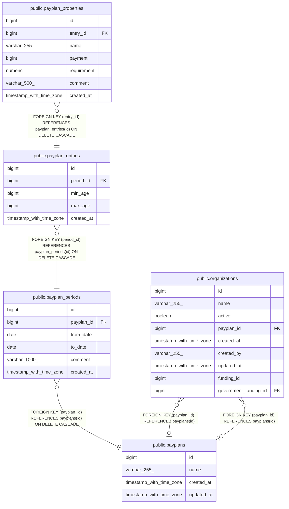

# public.payplan_periods

## Description

## Columns

| Name       | Type                     | Default                                     | Nullable | Children                                            | Parents                               | Comment |
| ---------- | ------------------------ | ------------------------------------------- | -------- | --------------------------------------------------- | ------------------------------------- | ------- |
| id         | bigint                   | nextval('payplan_periods_id_seq'::regclass) | false    | [public.payplan_entries](public.payplan_entries.md) |                                       |         |
| payplan_id | bigint                   |                                             | false    |                                                     | [public.payplans](public.payplans.md) |         |
| from_date  | date                     |                                             | false    |                                                     |                                       |         |
| to_date    | date                     |                                             | true     |                                                     |                                       |         |
| comment    | varchar(1000)            |                                             | true     |                                                     |                                       |         |
| created_at | timestamp with time zone |                                             | true     |                                                     |                                       |         |

## Constraints

| Name                                | Type        | Definition                                                         |
| ----------------------------------- | ----------- | ------------------------------------------------------------------ |
| payplan_periods_from_date_not_null  | n           | NOT NULL from_date                                                 |
| payplan_periods_id_not_null         | n           | NOT NULL id                                                        |
| payplan_periods_payplan_id_not_null | n           | NOT NULL payplan_id                                                |
| fk_payplans_periods                 | FOREIGN KEY | FOREIGN KEY (payplan_id) REFERENCES payplans(id) ON DELETE CASCADE |
| payplan_periods_pkey                | PRIMARY KEY | PRIMARY KEY (id)                                                   |

## Indexes

| Name                           | Definition                                                                                     |
| ------------------------------ | ---------------------------------------------------------------------------------------------- |
| payplan_periods_pkey           | CREATE UNIQUE INDEX payplan_periods_pkey ON public.payplan_periods USING btree (id)            |
| idx_payplan_periods_payplan_id | CREATE INDEX idx_payplan_periods_payplan_id ON public.payplan_periods USING btree (payplan_id) |
| idx_payplan_periods_funding_id | CREATE INDEX idx_payplan_periods_funding_id ON public.payplan_periods USING btree (payplan_id) |

## Relations

---

> Generated by [tbls](https://github.com/k1LoW/tbls)
