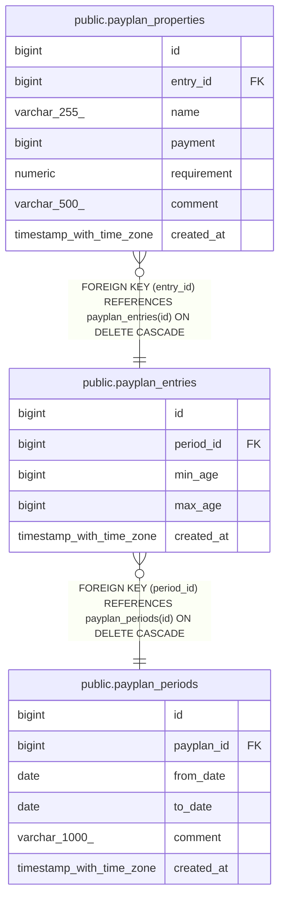

# public.payplan_properties

## Description

## Columns

| Name        | Type                     | Default                                        | Nullable | Children | Parents                                             | Comment |
| ----------- | ------------------------ | ---------------------------------------------- | -------- | -------- | --------------------------------------------------- | ------- |
| id          | bigint                   | nextval('payplan_properties_id_seq'::regclass) | false    |          |                                                     |         |
| entry_id    | bigint                   |                                                | false    |          | [public.payplan_entries](public.payplan_entries.md) |         |
| name        | varchar(255)             |                                                | false    |          |                                                     |         |
| payment     | bigint                   |                                                | false    |          |                                                     |         |
| requirement | numeric                  |                                                | false    |          |                                                     |         |
| comment     | varchar(500)             |                                                | true     |          |                                                     |         |
| created_at  | timestamp with time zone |                                                | true     |          |                                                     |         |

## Constraints

| Name                                    | Type        | Definition                                                              |
| --------------------------------------- | ----------- | ----------------------------------------------------------------------- |
| payplan_properties_entry_id_not_null    | n           | NOT NULL entry_id                                                       |
| payplan_properties_id_not_null          | n           | NOT NULL id                                                             |
| payplan_properties_name_not_null        | n           | NOT NULL name                                                           |
| payplan_properties_payment_not_null     | n           | NOT NULL payment                                                        |
| payplan_properties_requirement_not_null | n           | NOT NULL requirement                                                    |
| fk_payplan_entries_properties           | FOREIGN KEY | FOREIGN KEY (entry_id) REFERENCES payplan_entries(id) ON DELETE CASCADE |
| payplan_properties_pkey                 | PRIMARY KEY | PRIMARY KEY (id)                                                        |

## Indexes

| Name                            | Definition                                                                                       |
| ------------------------------- | ------------------------------------------------------------------------------------------------ |
| payplan_properties_pkey         | CREATE UNIQUE INDEX payplan_properties_pkey ON public.payplan_properties USING btree (id)        |
| idx_payplan_properties_entry_id | CREATE INDEX idx_payplan_properties_entry_id ON public.payplan_properties USING btree (entry_id) |

## Relations

---

> Generated by [tbls](https://github.com/k1LoW/tbls)
