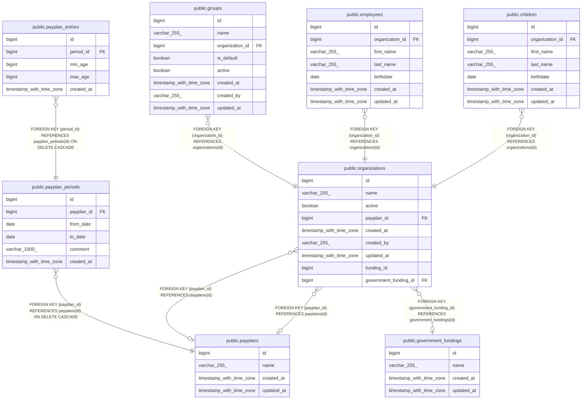

# public.payplans

## Description

## Columns

| Name       | Type                     | Default                              | Nullable | Children                                                                                            | Parents | Comment |
| ---------- | ------------------------ | ------------------------------------ | -------- | --------------------------------------------------------------------------------------------------- | ------- | ------- |
| id         | bigint                   | nextval('payplans_id_seq'::regclass) | false    | [public.payplan_periods](public.payplan_periods.md) [public.organizations](public.organizations.md) |         |         |
| name       | varchar(255)             |                                      | false    |                                                                                                     |         |         |
| created_at | timestamp with time zone |                                      | true     |                                                                                                     |         |         |
| updated_at | timestamp with time zone |                                      | true     |                                                                                                     |         |         |

## Constraints

| Name                   | Type        | Definition       |
| ---------------------- | ----------- | ---------------- |
| payplans_id_not_null   | n           | NOT NULL id      |
| payplans_name_not_null | n           | NOT NULL name    |
| payplans_pkey          | PRIMARY KEY | PRIMARY KEY (id) |

## Indexes

| Name              | Definition                                                                  |
| ----------------- | --------------------------------------------------------------------------- |
| payplans_pkey     | CREATE UNIQUE INDEX payplans_pkey ON public.payplans USING btree (id)       |
| idx_payplans_name | CREATE UNIQUE INDEX idx_payplans_name ON public.payplans USING btree (name) |

## Relations

---

> Generated by [tbls](https://github.com/k1LoW/tbls)
