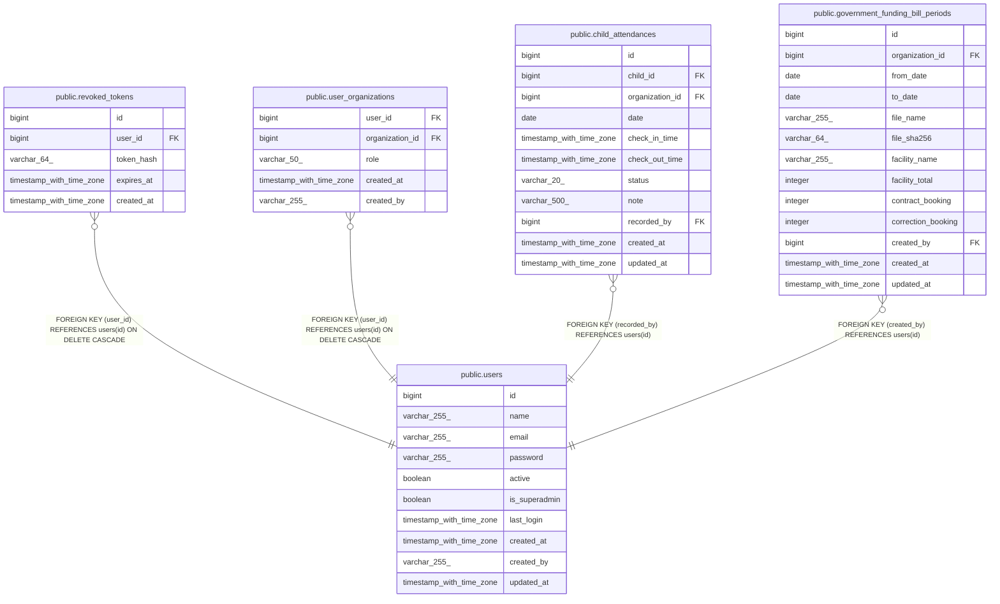

# public.revoked_tokens

## Description

## Columns

| Name       | Type                     | Default                                    | Nullable | Children | Parents                         | Comment |
| ---------- | ------------------------ | ------------------------------------------ | -------- | -------- | ------------------------------- | ------- |
| id         | bigint                   | nextval('revoked_tokens_id_seq'::regclass) | false    |          |                                 |         |
| user_id    | bigint                   |                                            | false    |          | [public.users](public.users.md) |         |
| token_hash | varchar(64)              |                                            | false    |          |                                 |         |
| expires_at | timestamp with time zone |                                            | false    |          |                                 |         |
| created_at | timestamp with time zone |                                            | true     |          |                                 |         |

## Constraints

| Name                               | Type        | Definition                                                   |
| ---------------------------------- | ----------- | ------------------------------------------------------------ |
| revoked_tokens_expires_at_not_null | n           | NOT NULL expires_at                                          |
| revoked_tokens_id_not_null         | n           | NOT NULL id                                                  |
| revoked_tokens_token_hash_not_null | n           | NOT NULL token_hash                                          |
| revoked_tokens_user_id_not_null    | n           | NOT NULL user_id                                             |
| revoked_tokens_user_id_fkey        | FOREIGN KEY | FOREIGN KEY (user_id) REFERENCES users(id) ON DELETE CASCADE |
| revoked_tokens_pkey                | PRIMARY KEY | PRIMARY KEY (id)                                             |

## Indexes

| Name                          | Definition                                                                                          |
| ----------------------------- | --------------------------------------------------------------------------------------------------- |
| revoked_tokens_pkey           | CREATE UNIQUE INDEX revoked_tokens_pkey ON public.revoked_tokens USING btree (id)                   |
| idx_revoked_tokens_token_hash | CREATE UNIQUE INDEX idx_revoked_tokens_token_hash ON public.revoked_tokens USING btree (token_hash) |
| idx_revoked_tokens_user_id    | CREATE INDEX idx_revoked_tokens_user_id ON public.revoked_tokens USING btree (user_id)              |
| idx_revoked_tokens_expires_at | CREATE INDEX idx_revoked_tokens_expires_at ON public.revoked_tokens USING btree (expires_at)        |

## Relations

---

> Generated by [tbls](https://github.com/k1LoW/tbls)
