# public.sections

## Description

## Columns

| Name            | Type                     | Default                              | Nullable | Children                                                                                                      | Parents                                         | Comment |
| --------------- | ------------------------ | ------------------------------------ | -------- | ------------------------------------------------------------------------------------------------------------- | ----------------------------------------------- | ------- |
| id              | bigint                   | nextval('sections_id_seq'::regclass) | false    | [public.employee_contracts](public.employee_contracts.md) [public.child_contracts](public.child_contracts.md) |                                                 |         |
| organization_id | bigint                   |                                      | false    |                                                                                                               | [public.organizations](public.organizations.md) |         |
| name            | varchar(255)             |                                      | false    |                                                                                                               |                                                 |         |
| is_default      | boolean                  | false                                | true     |                                                                                                               |                                                 |         |
| min_age_months  | integer                  |                                      | true     |                                                                                                               |                                                 |         |
| max_age_months  | integer                  |                                      | true     |                                                                                                               |                                                 |         |
| created_at      | timestamp with time zone |                                      | true     |                                                                                                               |                                                 |         |
| created_by      | varchar(255)             |                                      | true     |                                                                                                               |                                                 |         |
| updated_at      | timestamp with time zone |                                      | true     |                                                                                                               |                                                 |         |

## Constraints

| Name                              | Type        | Definition                                                                   |
| --------------------------------- | ----------- | ---------------------------------------------------------------------------- |
| sections_id_not_null              | n           | NOT NULL id                                                                  |
| sections_name_not_null            | n           | NOT NULL name                                                                |
| sections_organization_id_not_null | n           | NOT NULL organization_id                                                     |
| sections_organization_id_fkey     | FOREIGN KEY | FOREIGN KEY (organization_id) REFERENCES organizations(id) ON DELETE CASCADE |
| sections_pkey                     | PRIMARY KEY | PRIMARY KEY (id)                                                             |

## Indexes

| Name                         | Definition                                                                                      |
| ---------------------------- | ----------------------------------------------------------------------------------------------- |
| sections_pkey                | CREATE UNIQUE INDEX sections_pkey ON public.sections USING btree (id)                           |
| idx_sections_organization_id | CREATE INDEX idx_sections_organization_id ON public.sections USING btree (organization_id)      |
| idx_section_org_name         | CREATE UNIQUE INDEX idx_section_org_name ON public.sections USING btree (name, organization_id) |

## Relations

```mermaid
erDiagram

"public.employee_contracts" }o--|| "public.sections" : "FOREIGN KEY (section_id) REFERENCES sections(id)"
"public.employee_contracts" }o--|| "public.employees" : "FOREIGN KEY (employee_id) REFERENCES employees(id) ON DELETE CASCADE"
"public.employee_contracts" }o--|| "public.pay_plans" : "FOREIGN KEY (pay_plan_id) REFERENCES pay_plans(id)"
"public.child_contracts" }o--|| "public.sections" : "FOREIGN KEY (section_id) REFERENCES sections(id)"
"public.child_contracts" }o--|| "public.children" : "FOREIGN KEY (child_id) REFERENCES children(id) ON DELETE CASCADE"
"public.sections" }o--|| "public.organizations" : "FOREIGN KEY (organization_id) REFERENCES organizations(id) ON DELETE CASCADE"
"public.user_organizations" }o--|| "public.organizations" : "FOREIGN KEY (organization_id) REFERENCES organizations(id) ON DELETE CASCADE"
"public.employees" }o--|| "public.organizations" : "FOREIGN KEY (organization_id) REFERENCES organizations(id) ON DELETE CASCADE"
"public.pay_plans" }o--|| "public.organizations" : "FOREIGN KEY (organization_id) REFERENCES organizations(id)"
"public.children" }o--|| "public.organizations" : "FOREIGN KEY (organization_id) REFERENCES organizations(id) ON DELETE CASCADE"
"public.child_attendances" }o--|| "public.organizations" : "FOREIGN KEY (organization_id) REFERENCES organizations(id) ON DELETE CASCADE"
"public.budget_items" }o--|| "public.organizations" : "FOREIGN KEY (organization_id) REFERENCES organizations(id) ON DELETE CASCADE"
"public.audit_logs" }o--o| "public.organizations" : "FOREIGN KEY (organization_id) REFERENCES organizations(id) ON DELETE SET NULL"
"public.government_funding_bill_periods" }o--|| "public.organizations" : "FOREIGN KEY (organization_id) REFERENCES organizations(id)"

"public.sections" {
  bigint id
  bigint organization_id FK
  varchar_255_ name
  boolean is_default
  integer min_age_months
  integer max_age_months
  timestamp_with_time_zone created_at
  varchar_255_ created_by
  timestamp_with_time_zone updated_at
}
"public.employee_contracts" {
  bigint id
  bigint employee_id FK
  date from_date
  date to_date
  bigint section_id FK
  jsonb properties
  varchar_50_ staff_category
  varchar_20_ grade
  integer step
  double_precision weekly_hours
  bigint pay_plan_id FK
  timestamp_with_time_zone created_at
  timestamp_with_time_zone updated_at
}
"public.employees" {
  bigint id
  bigint organization_id FK
  varchar_255_ first_name
  varchar_255_ last_name
  varchar_20_ gender
  date birthdate
  timestamp_with_time_zone created_at
  timestamp_with_time_zone updated_at
}
"public.pay_plans" {
  bigint id
  bigint organization_id FK
  text name
  timestamp_with_time_zone created_at
  timestamp_with_time_zone updated_at
}
"public.child_contracts" {
  bigint id
  bigint child_id FK
  date from_date
  date to_date
  bigint section_id FK
  jsonb properties
  timestamp_with_time_zone created_at
  timestamp_with_time_zone updated_at
}
"public.children" {
  bigint id
  bigint organization_id FK
  varchar_255_ first_name
  varchar_255_ last_name
  varchar_20_ gender
  date birthdate
  timestamp_with_time_zone created_at
  timestamp_with_time_zone updated_at
}
"public.organizations" {
  bigint id
  varchar_255_ name
  boolean active
  varchar_50_ state
  timestamp_with_time_zone created_at
  varchar_255_ created_by
  timestamp_with_time_zone updated_at
}
"public.user_organizations" {
  bigint user_id FK
  bigint organization_id FK
  varchar_50_ role
  timestamp_with_time_zone created_at
  varchar_255_ created_by
}
"public.child_attendances" {
  bigint id
  bigint child_id FK
  bigint organization_id FK
  date date
  timestamp_with_time_zone check_in_time
  timestamp_with_time_zone check_out_time
  varchar_20_ status
  varchar_500_ note
  bigint recorded_by FK
  timestamp_with_time_zone created_at
  timestamp_with_time_zone updated_at
}
"public.budget_items" {
  bigint id
  bigint organization_id FK
  varchar_255_ name
  varchar_50_ category
  boolean per_child
  timestamp_with_time_zone created_at
  timestamp_with_time_zone updated_at
}
"public.audit_logs" {
  bigint id
  timestamp_with_time_zone timestamp
  bigint user_id
  varchar_255_ user_email
  varchar_100_ action
  varchar_100_ resource_type
  bigint resource_id
  varchar_45_ ip_address
  varchar_512_ user_agent
  text details
  boolean success
  bigint organization_id FK
}
"public.government_funding_bill_periods" {
  bigint id
  bigint organization_id FK
  date from_date
  date to_date
  varchar_255_ file_name
  varchar_64_ file_sha256
  varchar_255_ facility_name
  integer facility_total
  integer contract_booking
  integer correction_booking
  bigint created_by FK
  timestamp_with_time_zone created_at
  timestamp_with_time_zone updated_at
}
```

---

> Generated by [tbls](https://github.com/k1LoW/tbls)
