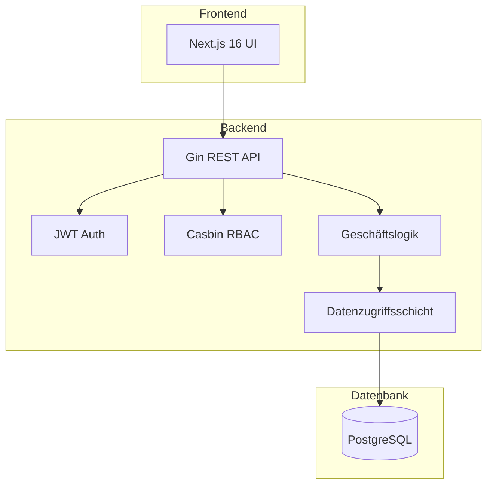
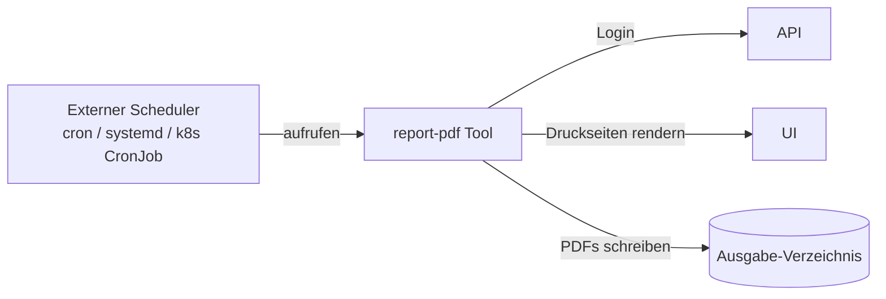

KitaManager folgt einem Clean-Architecture-Muster mit klarer Trennung der Verantwortlichkeiten.

## Systemübersicht



## RBAC-Architektur

Die Anwendung verwendet ein hybrides RBAC-System:

1. **Datenbank** speichert Benutzer-Rolle-Organisation-Zuweisungen (auditierbar, abfragbar)
2. **Casbin** speichert Rolle-Berechtigung-Zuordnungen (optimierte Richtlinienauswertung)

### Rollenhierarchie

| Rolle | Geltungsbereich | Berechtigungen |
|-------|-----------------|----------------|
| Superadmin | Global | Vollständiger Systemzugriff |
| Admin | Organisation | Vollständiger Org-Zugriff |
| Manager | Organisation | Operativer Zugriff |
| Mitglied | Organisation | Nur-Lese-Zugriff |
| Personal | Organisation | Anwesenheitsverwaltung |

### Organisationsbezogene Ressourcen

Ressourcen, die zu einer Organisation gehören, verwenden URL-Muster:

```
/api/v1/organizations/{orgId}/employees
/api/v1/organizations/{orgId}/children
/api/v1/organizations/{orgId}/sections
```

## Report-Tool

Ein eigenständiges CLI-Tool (`tools/report-pdf/`) erzeugt PDF-Berichte, indem es die Druckseiten des Frontends über Playwright rendert. Es ist **unabhängig von API und Frontend** — es authentifiziert sich per HTTP und erzeugt dieselben Diagramme und Tabellen, die Benutzer im Browser sehen.



Das Tool läuft **einmalig**: Es loggt sich ein, erzeugt die PDFs, schreibt sie auf die Platte und beendet sich. Wiederkehrende Auslieferung (wöchentliche / monatliche E-Mails an Stakeholder) übernimmt der Host-Scheduler — siehe das [README](https://github.com/eenemeene/kitamanager-go/tree/main/tools/report-pdf) des Tools für Beispiel-Konfigurationen für cron, systemd-timer und Kubernetes CronJob.

Jeder CLI-Flag liest auch aus einer `KITAMANAGER_REPORT_*`-Umgebungsvariable, was in Container-Deployments ideal ist, da Flags sonst in der Prozessliste sichtbar wären.

Berichte werden zu einem einzelnen PDF zusammengeführt mit den Bereichen Kinder, Belegung, Personal und Finanzen.

## Datenfluss

1. **Anfrage** erreicht den Gin-Router
2. **Middleware** behandelt Authentifizierung und Autorisierung
3. **Handler** validiert Eingaben und ruft die Service-Schicht auf
4. **Service** implementiert Geschäftslogik
5. **Store** führt Datenbankoperationen aus
6. **Antwort** wird serialisiert und zurückgegeben
