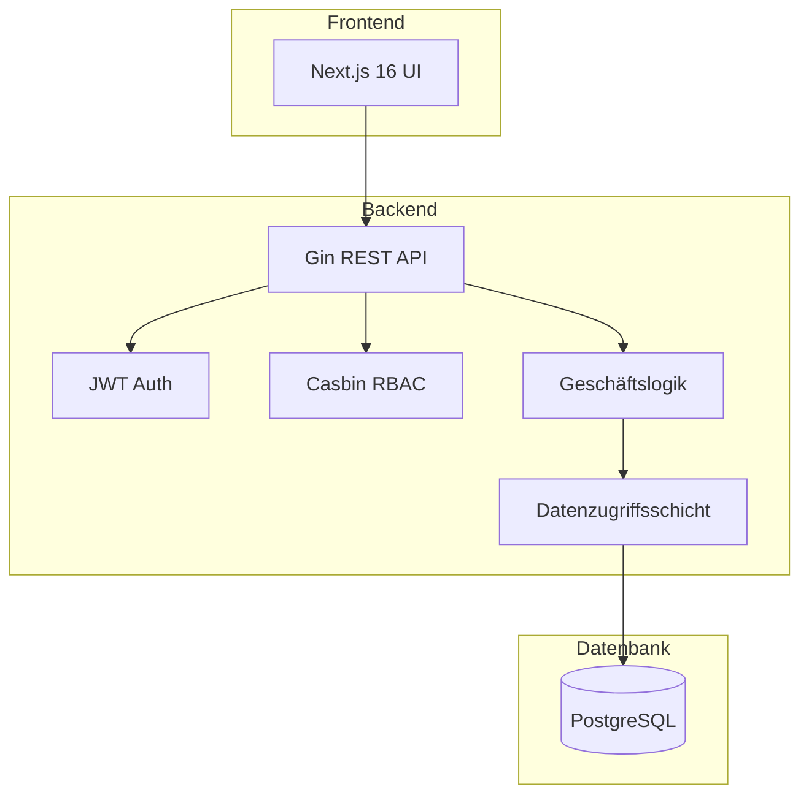
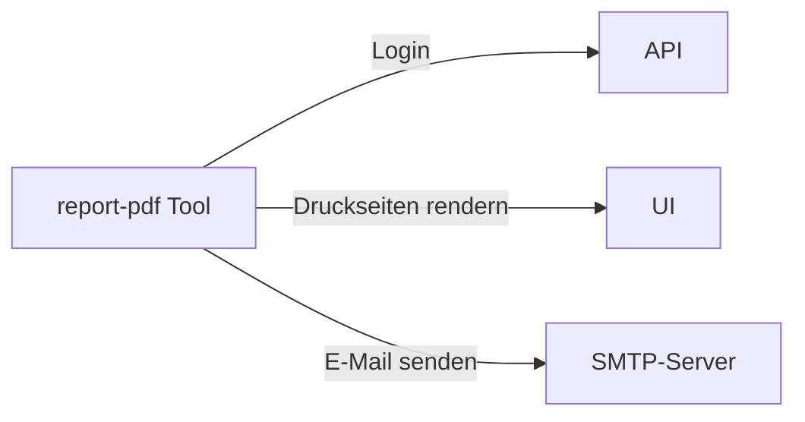

KitaManager folgt einem Clean-Architecture-Muster mit klarer Trennung der Verantwortlichkeiten.

## Systemübersicht



## RBAC-Architektur

Die Anwendung verwendet ein hybrides RBAC-System:

1. **Datenbank** speichert Benutzer-Rolle-Organisation-Zuweisungen (auditierbar, abfragbar)
2. **Casbin** speichert Rolle-Berechtigung-Zuordnungen (optimierte Richtlinienauswertung)

### Rollenhierarchie

| Rolle | Geltungsbereich | Berechtigungen |
|-------|-----------------|----------------|
| Superadmin | Global | Vollständiger Systemzugriff |
| Admin | Organisation | Vollständiger Org-Zugriff |
| Manager | Organisation | Operativer Zugriff |
| Mitglied | Organisation | Nur-Lese-Zugriff |
| Personal | Organisation | Anwesenheitsverwaltung |

### Organisationsbezogene Ressourcen

Ressourcen, die zu einer Organisation gehören, verwenden URL-Muster:

```
/api/v1/organizations/{orgId}/employees
/api/v1/organizations/{orgId}/children
/api/v1/organizations/{orgId}/sections
```

## Report-Tool

Ein eigenständiges CLI-Tool (`tools/report-pdf/`) erzeugt PDF-Berichte, indem es die Druckseiten des Frontends über Playwright rendert. Es ist **unabhängig von API und Frontend** — es authentifiziert sich per HTTP und erzeugt dieselben Diagramme und Tabellen, die Benutzer im Browser sehen.



Das Tool unterstützt zwei Modi:
- **Einmalig**: PDF-Erzeugung über die Kommandozeile
- **Geplant**: Langlebiger Dienst, der Berichte per E-Mail nach einem wöchentlichen oder monatlichen Zeitplan versendet (konfiguriert per YAML-Datei)

Berichte werden zu einem einzelnen PDF zusammengeführt mit den Bereichen Kinder, Belegung, Personal und Finanzen.

## Datenfluss

1. **Anfrage** erreicht den Gin-Router
2. **Middleware** behandelt Authentifizierung und Autorisierung
3. **Handler** validiert Eingaben und ruft die Service-Schicht auf
4. **Service** implementiert Geschäftslogik
5. **Store** führt Datenbankoperationen aus
6. **Antwort** wird serialisiert und zurückgegeben
