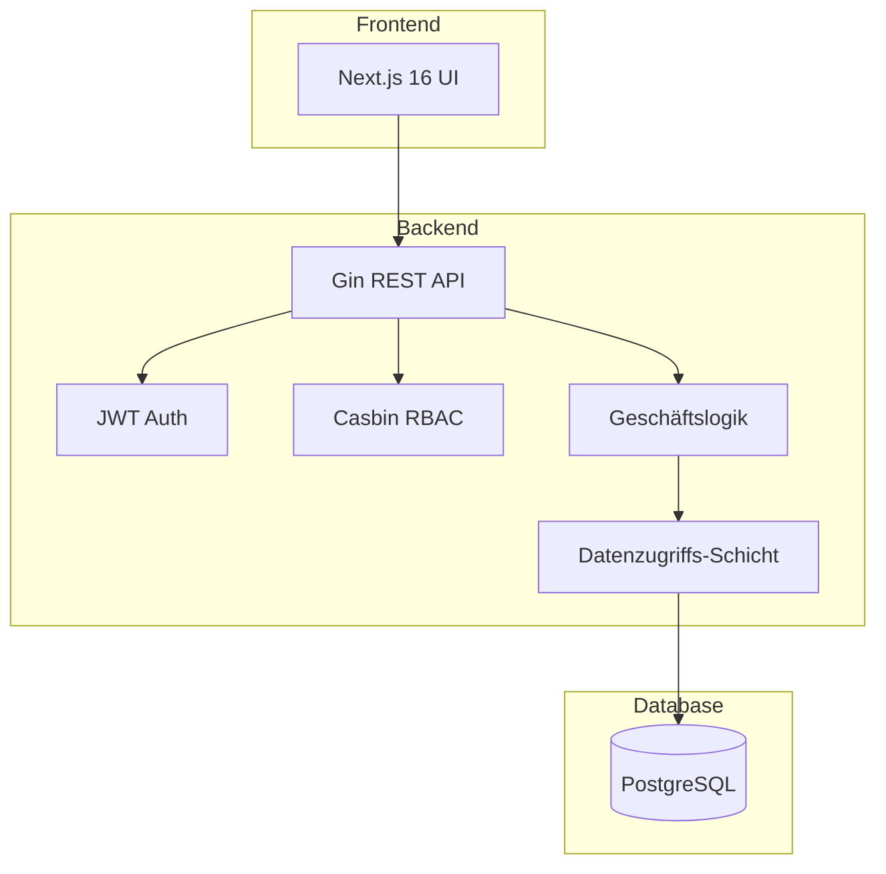
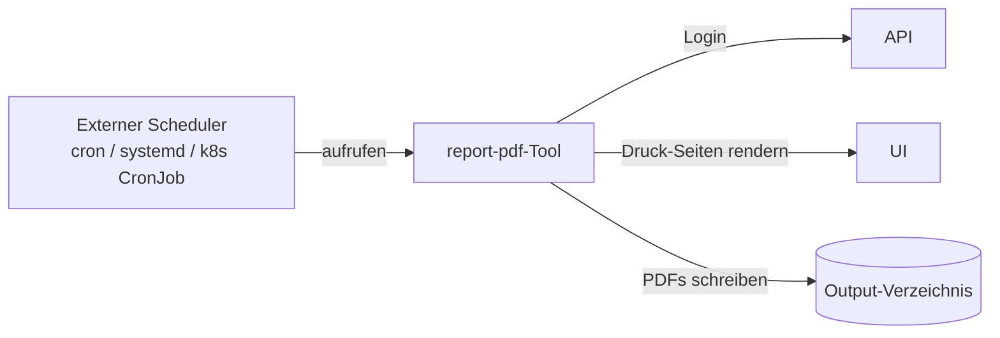

KitaManager ist eine Go-REST-API (Gin + GORM + Casbin) plus ein Next.js-Frontend, gestützt auf PostgreSQL. Die Trennung ist konventionell: das Frontend ist ein zustandsloser Client, die API hält die gesamte Geschäftslogik, und die Datenbank ist der einzige persistente Zustand.

## Systemüberblick



Eine Anfrage folgt einem festen Pfad durch die Schichten:

1. **Anfrage** trifft am Gin-Router ein.
2. **Middleware** kümmert sich um Authentifizierung (Cookie-Sitzungs-Lookup) und Autorisierung (Casbin-Policy-Check).
3. **Handler** validiert Eingaben (Binding + Struct-Tags) und ruft die Service-Schicht auf.
4. **Service** implementiert Geschäftslogik — die einzige Schicht, die mehrere Stores umspannen darf.
5. **Store** führt Datenbank-Operationen gegen GORM-Modelle aus.
6. **Antwort** wird serialisiert und zurückgegeben.

Die gleiche Trennung erscheint auf der Festplatte: `internal/handlers/`, `internal/middleware/`, `internal/service/`, `internal/store/`, `internal/models/`. Das ist die Struktur, auf die die path-scoped Regeln in `.claude/rules/` verweisen.

## RBAC-Architektur

Die Anwendung nutzt ein hybrides RBAC-System:

1. **Datenbank** speichert Nutzer-Rolle-Organisation-Zuweisungen (auditable, abfragbar).
2. **Casbin** speichert Rolle-Berechtigung-Mappings (optimierte Policy-Auswertung).

Wenn eine Anfrage hereinkommt, schaut die Middleware in der DB die Rolle des Nutzers für die angefragte Organisation nach und fragt dann Casbin „darf Rolle X die Aktion Y auf Ressource Z?". Casbin antwortet ja/nein; die Middleware ruft entweder den Handler auf oder gibt 403 zurück.

### Rollen-Hierarchie

| Rolle | Geltungsbereich | Berechtigungen |
|------|-------|-------------|
| `superadmin` | Global | Vollzugriff auf das System |
| `admin` | Organisation | Vollzugriff auf Org |
| `manager` | Organisation | Operativer Zugriff |
| `member` | Organisation | Nur-Lese-Zugriff |
| `staff` | Organisation | Anwesenheits-Verwaltung |

Für die vollständige Berechtigungsmatrix siehe [Referenz: RBAC](../../reference/rbac/).

### Organisations-bezogene Ressourcen

Ressourcen, die zu einer Organisation gehören, nutzen URL-Schemata, die die Org-ID enthalten:

```
/api/v1/organizations/{orgId}/employees
/api/v1/organizations/{orgId}/children
/api/v1/organizations/{orgId}/sections
```

Die Org-ID ist der Routing-Schlüssel sowohl für Autorisierung (auf welche Org-Daten dürfen Sie zugreifen?) als auch für Daten-Scoping (das `WHERE organization_id = ?` wird von der Store-Schicht hinzugefügt). Ein `superadmin` darf jede Org adressieren; alle anderen sind auf die Orgs beschränkt, in denen sie Mitglied sind.

## Report-Tool

Ein eigenständiges CLI-Tool (`tools/report-pdf/`) erzeugt PDF-Berichte, indem es die Druck-Seiten des Frontends per Playwright rendert. Es ist **unabhängig von API und Frontend** — es authentifiziert sich per HTTP und produziert dieselben Diagramme und Tabellen, die Nutzer:innen im Browser sehen.



Das Tool ist **One-Shot**: es meldet sich an, erzeugt PDFs, schreibt sie auf die Festplatte und beendet sich. Wiederkehrende Verteilung (wöchentliche / monatliche E-Mails an Stakeholder) wird an den Host-Scheduler delegiert — siehe das [README des Tools](https://github.com/eenemeene/kitamanager-go/tree/main/tools/report-pdf) für cron-, systemd-Timer- und Kubernetes-CronJob-Rezepte.

Jeder CLI-Schalter liest auch aus einer `KITAMANAGER_REPORT_*`-Umgebungsvariable, was die natürliche Form für Container-Bereitstellungen ist, wo Schalter sonst in die Prozessliste lecken würden.

Berichte werden zu einer einzelnen PDF zusammengefasst, die Kinder-, Belegungs-, Personal- und Finanz-Sektionen enthält.

## Soft-Delete für Nutzer:innen und Organisationen

Migration 000015 machte die Tabellen `users` und `organizations` soft-deleted: ein `DELETE` auf Anwendungs-Ebene stempelt `deleted_at`, statt die Zeile physisch zu entfernen. Drei Gründe:

1. **Audit-Trail-Erhaltung.** Audit-Log-Einträge referenzieren Nutzer:innen über ID. Wenn ein Nutzer-Datensatz verschwände, würden die Einträge entweder hängen oder müssten umgeschrieben werden.
2. **Reversibilität.** „Hoppla, der Account war wichtig" braucht ein Undo ohne Backup-Restore.
3. **Kontrollierte DSGVO-Art.-17-Löschung.** Echte Löschung hat spezifische Anforderungen (Freitextfelder gelöscht). Ein dedizierter `HardDelete`-Codepfad, der das absichtlich tut, ist sicherer als ein Default-Delete, das die Anforderungen gelegentlich erfüllt.

Admin-Wiederherstellung erfolgt heute nur direkt-DB — siehe [Soft-gelöschte Nutzer:in oder Organisation wiederherstellen](../../how-to/operate/restore-a-soft-deleted-user-or-organization/). Eine Trash-View-UI ist geplant.

Die Asymmetrie zwischen Tabellen ist Absicht: nur `users` und `organizations` werden tombstoned. Kinder, Mitarbeiter, Verträge, Bereiche, Bescheide, Audit-Log-Einträge hard-deleten beim `DELETE`, weil identitätstragende Zeilen den Tombstone brauchen, während Datensatz-Zeilen physisch entfernt werden können, ohne den Audit-Trail zu brechen (der unabhängig erhalten wird).

Für die Mitwirkenden-Regel zum Schreiben von Queries, die das Soft-Delete-Invariant respektieren (Auto-Scoping vs. JOIN'ed Tabellen), siehe [Datenbank-Migration hinzufügen](../../how-to/develop/add-a-database-migration/) und `.claude/rules/database.md`.

## Datenfluss

1. **Anfrage** trifft am Gin-Router ein.
2. **Middleware** kümmert sich um Authentifizierung und Autorisierung.
3. **Handler** validiert Eingaben und ruft die Service-Schicht auf.
4. **Service** implementiert Geschäftslogik.
5. **Store** führt Datenbank-Operationen aus.
6. **Antwort** wird serialisiert und zurückgegeben.
