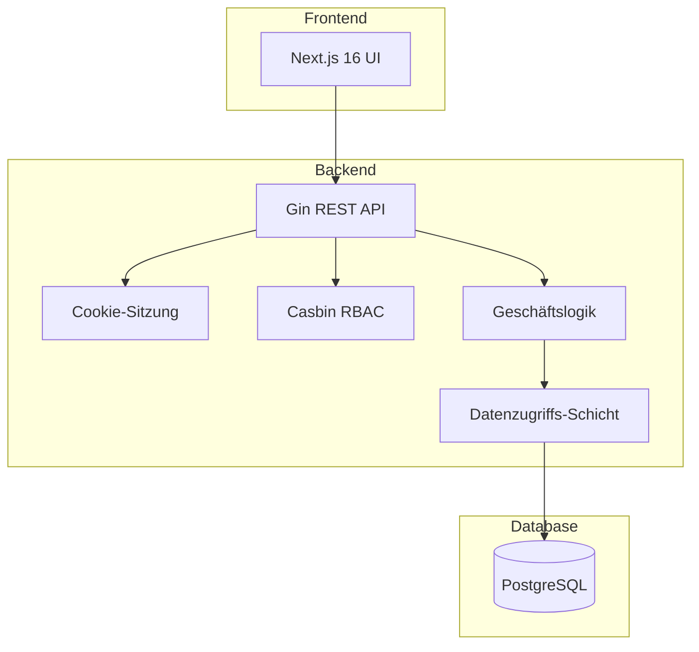

KitaManager ist eine Go-REST-API (Gin + GORM + Casbin) plus ein Next.js-Frontend, gestützt auf PostgreSQL. Das Frontend ist ein zustandsloser Client; die API hält die gesamte Geschäftslogik; die Datenbank ist der einzige persistente Zustand.

## Systemüberblick



Eine Anfrage folgt einem festen Pfad durch die Schichten:

1. **Anfrage** trifft am Gin-Router ein.
2. **Middleware** kümmert sich um Authentifizierung (Cookie-Sitzungs-Lookup) und Autorisierung (Casbin-Policy-Check).
3. **Handler** validiert Eingaben (Binding + Struct-Tags) und ruft die Service-Schicht auf.
4. **Service** implementiert Geschäftslogik — die einzige Schicht, die mehrere Stores umspannen darf.
5. **Store** führt Datenbank-Operationen gegen GORM-Modelle aus.
6. **Antwort** wird serialisiert und zurückgegeben.

Die gleiche Trennung erscheint auf der Festplatte: `internal/handlers/`, `internal/middleware/`, `internal/service/`, `internal/store/`, `internal/models/`. Das ist die Struktur, auf die die path-scoped Regeln in `.claude/rules/` verweisen.

## Organisations-bezogene Ressourcen

Ressourcen, die zu einer Organisation gehören, nutzen URL-Schemata, die die Org-ID enthalten:

```
/api/v1/organizations/{orgId}/employees
/api/v1/organizations/{orgId}/children
/api/v1/organizations/{orgId}/sections
```

Die Org-ID ist der Routing-Schlüssel sowohl für Autorisierung (auf welche Org-Daten dürfen Sie zugreifen?) als auch für Daten-Scoping (das `WHERE organization_id = ?` wird von der Store-Schicht hinzugefügt). Ein `superadmin` darf jede Org adressieren; alle anderen sind auf die Orgs beschränkt, in denen sie Mitglied sind.

## Unterthemen

- [Das Report-Tool](the-report-tool/) — wie das eigenständige PDF-Sidecar einpasst.
- [Warum Nutzer:innen und Organisationen soft-gelöscht sind](why-users-and-orgs-are-soft-deleted/) — das Tombstone-Modell und was es im Code kostet.

Für RBAC-Rollen + Berechtigungsmatrix siehe [Referenz: RBAC](../../reference/rbac/). Die hybride Implementierung (DB speichert Zuweisungen, Casbin speichert Policy) liegt im Intro dieser Seite.
