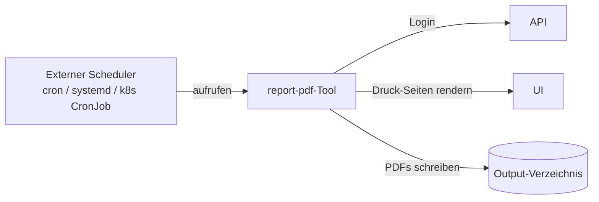

Ein eigenständiges CLI-Tool (`tools/report-pdf/`) erzeugt PDF-Berichte, indem es die Druck-Seiten des Frontends per Playwright rendert. Es ist **unabhängig von API und Frontend** — es authentifiziert sich per HTTP und produziert dieselben Diagramme und Tabellen, die Nutzer:innen im Browser sehen.

Das Tool ist **One-Shot**: es meldet sich an, erzeugt PDFs, schreibt sie auf die Festplatte und beendet sich. Wiederkehrende Verteilung (wöchentliche / monatliche E-Mails an Stakeholder) wird an den Host-Scheduler delegiert — siehe das [README des Tools](https://github.com/eenemeene/kitamanager-go/tree/main/tools/report-pdf) für cron-, systemd-Timer- und Kubernetes-CronJob-Rezepte.

Jeder CLI-Schalter liest auch aus einer `KITAMANAGER_REPORT_*`-Umgebungsvariable. Berichte werden zu einer einzelnen PDF mit Kinder-, Belegungs-, Personal- und Finanz-Sektionen zusammengefasst.
