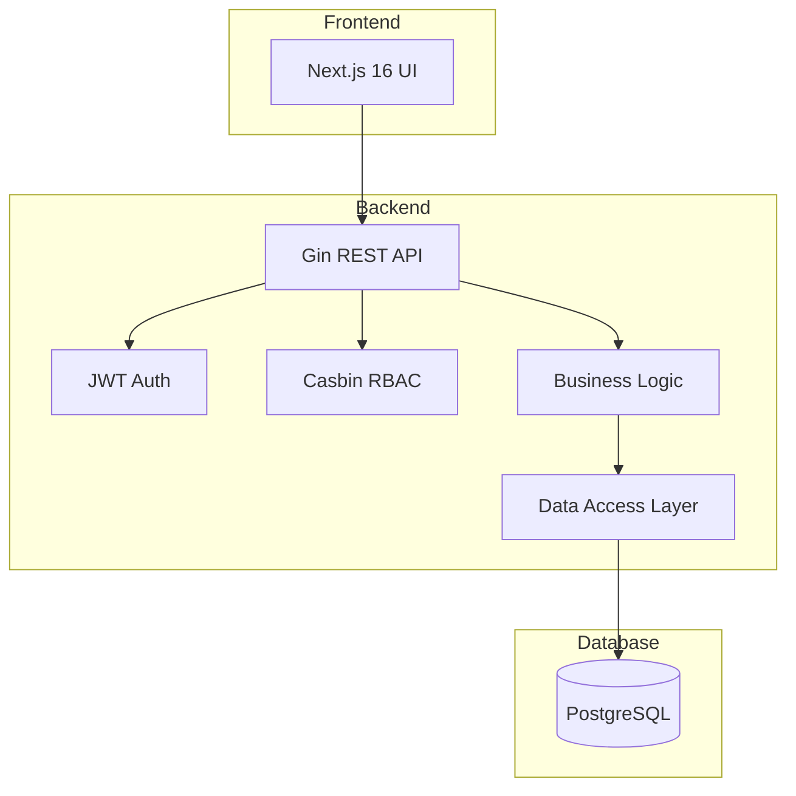

KitaManager follows a clean architecture pattern with clear separation of concerns.

## System Overview



## RBAC Architecture

The application uses a hybrid RBAC system:

1. **Database** stores user-role-organization assignments (auditable, queryable)
2. **Casbin** stores role-permission mappings (optimized policy evaluation)

### Role Hierarchy

| Role | Scope | Permissions |
|------|-------|-------------|
| Superadmin | Global | Full system access |
| Admin | Organization | Full org access |
| Manager | Organization | Operational access |
| Member | Organization | Read-only access |
| Staff | Organization | Attendance management |

### Organization-Scoped Resources

Resources that belong to an organization use URL patterns:

```
/api/v1/organizations/{orgId}/employees
/api/v1/organizations/{orgId}/children
/api/v1/organizations/{orgId}/sections
```

## Data Flow

1. **Request** arrives at Gin router
2. **Middleware** handles authentication and authorization
3. **Handler** validates input and calls service layer
4. **Service** implements business logic
5. **Store** performs database operations
6. **Response** is serialized and returned
