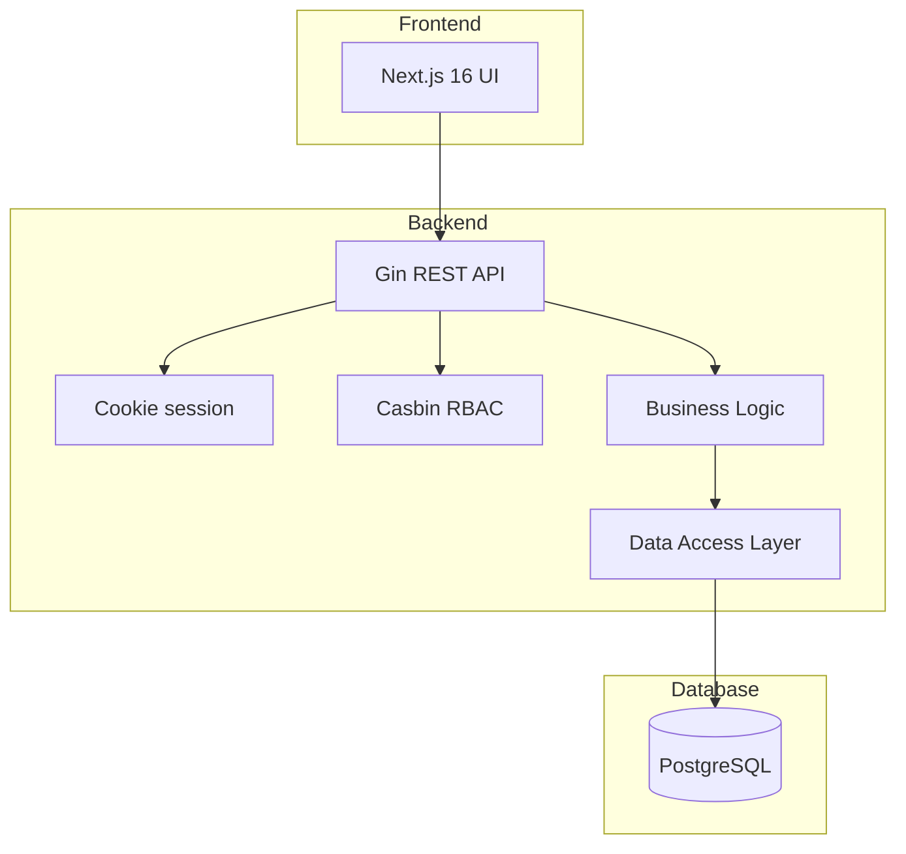

KitaManager is a Go REST API (Gin + GORM + Casbin) plus a Next.js frontend, backed by PostgreSQL. The frontend is a stateless client; the API holds all business logic; the database is the only persistent state.

## System overview



A request follows a fixed path through the layers:

1. **Request** arrives at the Gin router.
2. **Middleware** handles authentication (cookie session lookup) and authorisation (Casbin policy check).
3. **Handler** validates input (binding + struct tags) and calls the service layer.
4. **Service** implements business logic — the only layer allowed to span multiple stores.
5. **Store** performs database operations against GORM models.
6. **Response** is serialised and returned.

The same separation appears on disk: `internal/handlers/`, `internal/middleware/`, `internal/service/`, `internal/store/`, `internal/models/`. This is the structure the path-scoped rules in `.claude/rules/` reference.

## Organisation-scoped resources

Resources that belong to an organisation use URL patterns that include the org ID:

```
/api/v1/organizations/{orgId}/employees
/api/v1/organizations/{orgId}/children
/api/v1/organizations/{orgId}/sections
```

The org ID is the routing key for both authorization (which org's data are you allowed to touch?) and data scoping (the SQL `WHERE organization_id = ?` is added by the store layer). A `superadmin` can address any org; everyone else is restricted to the orgs they're a member of.

## Sub-topics

- [The report tool](the-report-tool/) — how the standalone PDF sidecar fits in.
- [Why users and orgs are soft-deleted](why-users-and-orgs-are-soft-deleted/) — the tombstone model and what it costs in code.

For RBAC roles + permission matrix see [Reference: RBAC](../../reference/rbac/). The hybrid implementation (DB stores assignments, Casbin stores policy) lives in that page's intro.
