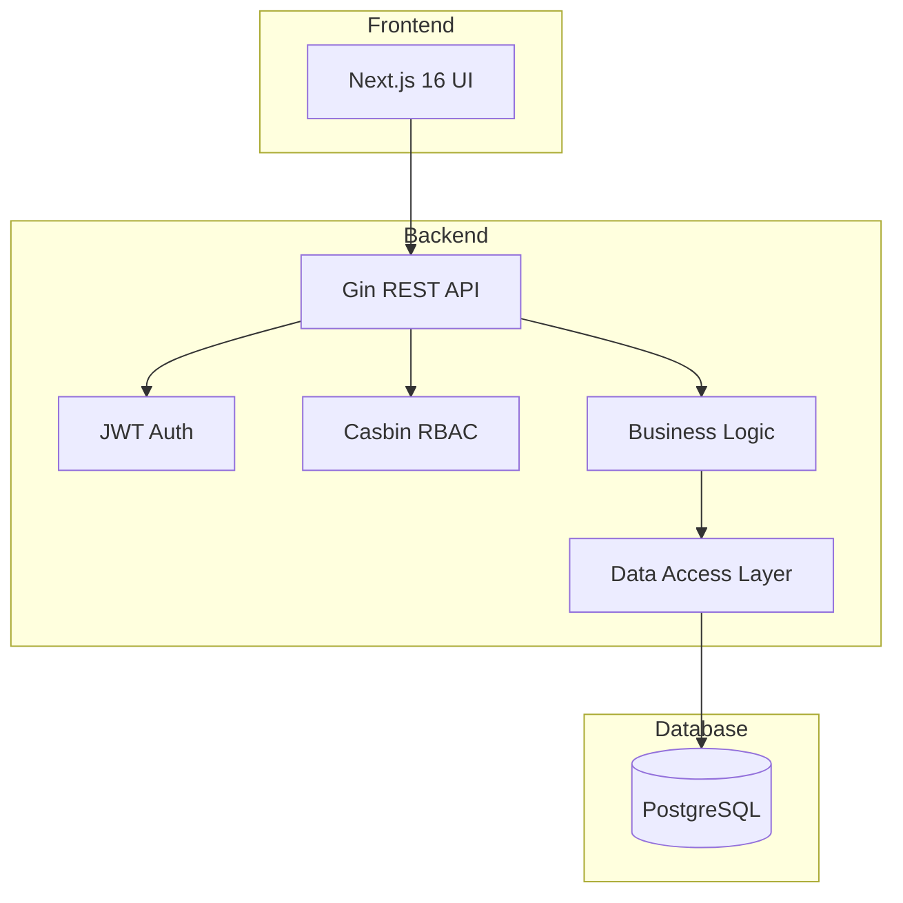
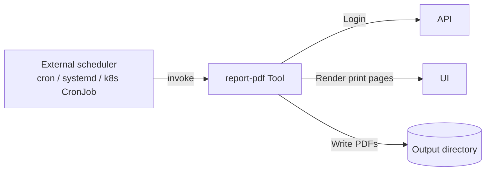

KitaManager is a Go REST API (Gin + GORM + Casbin) plus a Next.js frontend, backed by PostgreSQL. The split is conventional: the frontend is a stateless client, the API holds all business logic, and the database is the only persistent state.

## System overview



A request follows a fixed path through the layers:

1. **Request** arrives at the Gin router.
2. **Middleware** handles authentication (cookie session lookup) and authorisation (Casbin policy check).
3. **Handler** validates input (binding + struct tags) and calls the service layer.
4. **Service** implements business logic — the only layer allowed to span multiple stores.
5. **Store** performs database operations against GORM models.
6. **Response** is serialised and returned.

The same separation appears on disk: `internal/handlers/`, `internal/middleware/`, `internal/service/`, `internal/store/`, `internal/models/`. This is the structure the path-scoped rules in `.claude/rules/` reference.

## RBAC architecture

The application uses a hybrid RBAC system:

1. **Database** stores user-role-organisation assignments (auditable, queryable).
2. **Casbin** stores role-permission mappings (optimised policy evaluation).

When a request comes in, the middleware looks up the user's role for the requested organisation in the DB, then asks Casbin "can role X do action Y on resource Z?". Casbin returns a yes/no; the middleware either calls the handler or returns 403.

### Role hierarchy

| Role | Scope | Permissions |
|------|-------|-------------|
| `superadmin` | Global | Full system access |
| `admin` | Organisation | Full org access |
| `manager` | Organisation | Operational access |
| `member` | Organisation | Read-only access |
| `staff` | Organisation | Attendance management |

For the full permission matrix, see [Reference: RBAC](../../reference/rbac/).

### Organisation-scoped resources

Resources that belong to an organisation use URL patterns that include the org ID:

```
/api/v1/organizations/{orgId}/employees
/api/v1/organizations/{orgId}/children
/api/v1/organizations/{orgId}/sections
```

The org ID is the routing key for both authorization (which org's data are you allowed to touch?) and data scoping (the SQL `WHERE organization_id = ?` is added by the store layer). A `superadmin` can address any org; everyone else is restricted to the orgs they're a member of.

## Report tool

A standalone CLI tool (`tools/report-pdf/`) generates PDF reports by rendering the frontend's print pages via Playwright. It is **independent from the API and frontend** — it authenticates via HTTP and produces the same charts and tables users see in the browser.



The tool is **one-shot**: it logs in, generates PDFs, writes them to disk, and exits. Recurring delivery (weekly / monthly emails to stakeholders) is delegated to the host scheduler — see the tool's [README](https://github.com/eenemeene/kitamanager-go/tree/main/tools/report-pdf) for cron, systemd-timer, and Kubernetes CronJob recipes.

Every CLI flag also reads from a `KITAMANAGER_REPORT_*` environment variable, which is the natural fit for container deployments where flags would otherwise leak into the process listing.

Reports are merged into a single PDF containing children, occupancy, staffing, and financials sections.

## Soft-delete for users and organisations

Migration 000015 made the `users` and `organizations` tables soft-deleted: a `DELETE` at the application layer stamps `deleted_at` rather than physically removing the row. Three reasons:

1. **Audit-trail preservation.** Audit log entries reference users by ID. If a user record vanished, those entries would either dangle or have to be rewritten.
2. **Reversibility.** "Oops, that account was important" needs an undo without a backup restore.
3. **Controlled DSGVO Art. 17 erasure.** True erasure has specific requirements (free-form fields wiped). A dedicated `HardDelete` codepath that does it deliberately is safer than a default delete that occasionally satisfies erasure.

Admin restore today is direct-DB only — see [Restore a soft-deleted user or organization](../../how-to/operate/restore-a-soft-deleted-user-or-organization/). A trash-view UI is planned.

The asymmetry across tables is deliberate: only `users` and `organizations` are tombstoned. Children, employees, contracts, sections, bills, audit log entries hard-delete on `DELETE` because identity-bearing rows need the tombstone, while record-keeping rows can be physically removed without breaking the audit trail (which is preserved independently).

For the contributor rule on writing queries that respect the soft-delete invariant (auto-scoping vs. JOIN'd tables), see [Add a database migration](../../how-to/develop/add-a-database-migration/) and `.claude/rules/database.md`.
