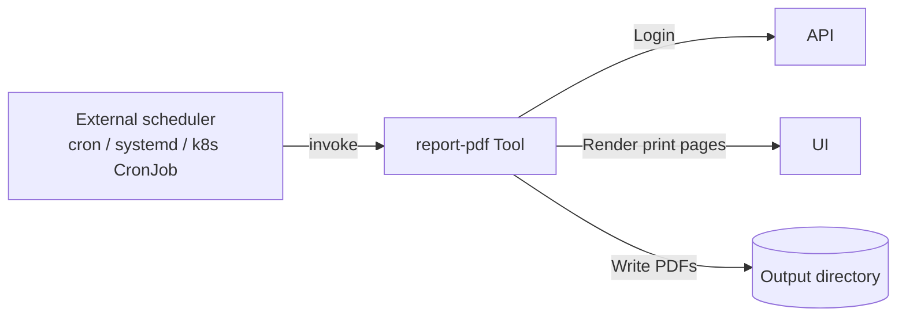

A standalone CLI tool (`tools/report-pdf/`) generates PDF reports by rendering the frontend's print pages via Playwright. It is **independent from the API and frontend** — it authenticates via HTTP and produces the same charts and tables users see in the browser.

The tool is **one-shot**: it logs in, generates PDFs, writes them to disk, and exits. Recurring delivery (weekly / monthly emails to stakeholders) is delegated to the host scheduler — see the tool's [README](https://github.com/eenemeene/kitamanager-go/tree/main/tools/report-pdf) for cron, systemd-timer, and Kubernetes CronJob recipes.

Every CLI flag also reads from a `KITAMANAGER_REPORT_*` environment variable. Reports are merged into a single PDF containing children, occupancy, staffing, and financials sections.
